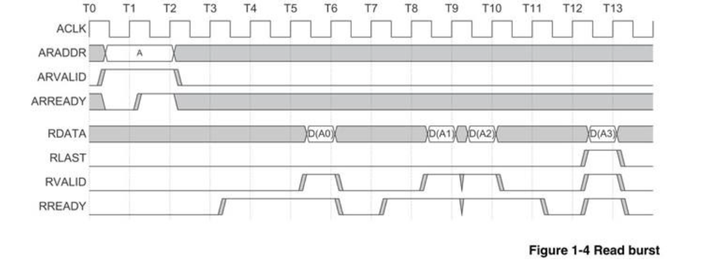
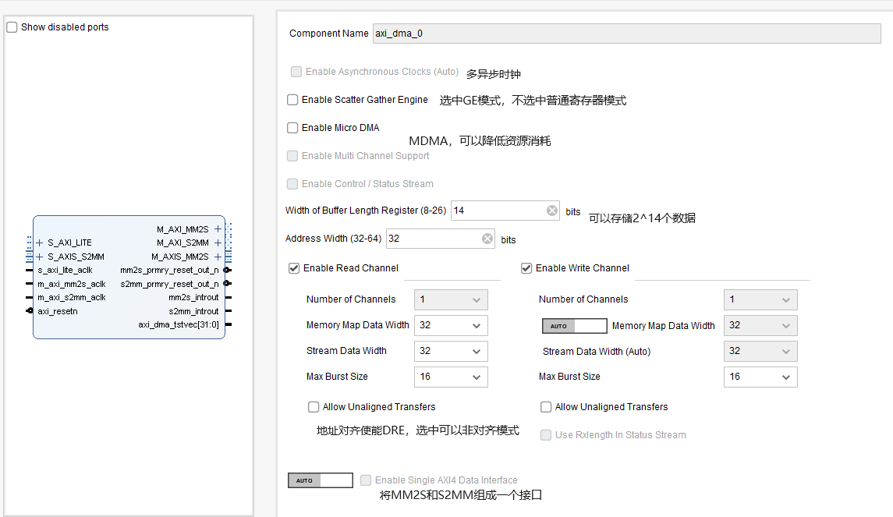

# AXI 协议  
## 1、通道信号  
写请求：携带地址和控制信号  
AWVALID//主机  
AWREADY//从机  
AWADDR  
AWLEN  //突发长度
AWSIZE //突发大小，字节为单位，一次传输的数据量为AWLEN * AWSIZE（Byte）
写数据：携带数据和控制信号  
WVALID//主机  
WREADY//从机  
WDATA  
WLAST//主机  
写相应  
BVALID//从机  
BREADY//主机  
读请求  
AWVALID//主机  
AWREADY//从机  
ARADDR  
读数据  
RVALID//从机  
RREADY//主机  
RLAST//从机  
除了写相应和读数据通道，其他都是VALID为主机，RAEADY为从机  

## 状态机
  
```
always @ ( posedge M_AXI_ACLK)                                                                            
	  begin                                                                                                     
	    if (M_AXI_ARESETN == 1'b0 )                                                                             
	      begin                                                                                                                               
	        mst_exec_state      <= IDLE;                                                                
	        start_single_burst_write <= 1'b0;                                                                   
	        start_single_burst_read  <= 1'b0;                                                                   
	        compare_done      <= 1'b0;                                                                          
	        ERROR <= 1'b0;   
	      end                                                                                                   
	    else                                                                                                    
	      begin                                                                                                                                                                              
	        case (mst_exec_state)                                                                               
	                                                                                                            
	          IDLE:                                                                                                                                                       
	            if ( init_txn_pulse == 1'b1)                                                      
	              begin                                                                                         
	                mst_exec_state  <= INIT_WRITE;                                                              
	                ERROR <= 1'b0;
	                compare_done <= 1'b0;
	              end                                                                                           
	            else                                                                                            
	              begin                                                                                         
	                mst_exec_state  <= IDLE;                                                            
	              end                                                                                           
	                                                                                                            
	          INIT_WRITE:                                                                                                                                                                   
	            if (writes_done)                                                                                
	              begin                                                                                         
	                mst_exec_state <= INIT_READ;//                                                              
	              end                                                                                           
	            else                                                                                            
	              begin                                                                                         
	                mst_exec_state  <= INIT_WRITE;                                                              
	                                                                                                            
	                if (~axi_awvalid && ~start_single_burst_write && ~burst_write_active)                       
	                  begin                                                                                     
	                    start_single_burst_write <= 1'b1;                                                       
	                  end                                                                                       
	                else                                                                                        
	                  begin                                                                                     
	                    start_single_burst_write <= 1'b0; //Negate to generate a pulse                          
	                  end                                                                                       
	              end                                                                                           
	                                                                                                            
	          INIT_READ:                                                                                                                                                                   
	            if (reads_done)                                                                                 
	              begin                                                                                         
	                mst_exec_state <= INIT_COMPARE;                                                             
	              end                                                                                           
	            else                                                                                            
	              begin                                                                                         
	                mst_exec_state  <= INIT_READ;                                                               
	                                                                                                            
	                if (~axi_arvalid && ~burst_read_active && ~start_single_burst_read)                         
	                  begin                                                                                     
	                    start_single_burst_read <= 1'b1;                                                        
	                  end                                                                                       
	               else                                                                                         
	                 begin                                                                                      
	                   start_single_burst_read <= 1'b0; //Negate to generate a pulse                            
	                 end                                                                                        
	              end                                                                                           
	                                                                                                            
	          INIT_COMPARE:                                                                                                                                                                                
	            begin                                                                                           
	              ERROR <= error_reg;
	              mst_exec_state <= IDLE;                                                               
	              compare_done <= 1'b1;                                                                         
	            end                                                                                             
	          default :                                                                                         
	            begin                                                                                           
	              mst_exec_state  <= IDLE;                                                              
	            end                                                                                             
	        endcase                                                                                             
	      end                                                                                                   
	  end
```
## 2、数据传输握手协议  
VALID 和 READY信号握手  
## 3、写请求过程  
写相应通道的握手只有 一个时钟周期，目的主要是将写地址传递给从机，并且握手成功自增突发长度*数据位宽（Byte）的长度  
```
 always @(posedge M_AXI_ACLK)                                   
	  begin                                                        
	    if (M_AXI_ARESETN == 0 || init_txn_pulse == 1'b1 )                                           
	      begin                                                            
	        axi_awvalid <= 1'b0;                                           
	      end                                                                 
	    else if (~axi_awvalid && start_single_burst_write)                 
	      begin                                                            
	        axi_awvalid <= 1'b1;                                           
	      end                                                                    
	    else if (M_AXI_AWREADY && axi_awvalid)                             
	      begin                                                            
	        axi_awvalid <= 1'b0;                                           
	      end                                                              
	    else                                                               
	      axi_awvalid <= axi_awvalid;                                      
	    end  
```
## 4、写数据过程  
在WVALID和WREADY都有效时写入数据，在最后一个信号写入后拉低WVALID信号
```
assign wnext = M_AXI_WREADY & axi_wvalid;                                                  
	  always @(posedge M_AXI_ACLK)                                                      
	  begin                                                                             
	    if (M_AXI_ARESETN == 0 || init_txn_pulse == 1'b1 )                                                        
	      begin                                                                         
	        axi_wvalid <= 1'b0;                                                         
	      end                                                                                               
	    else if (~axi_wvalid && start_single_burst_write)                               
	      begin                                                                         
	        axi_wvalid <= 1'b1;                                                         
	      end                                                                                                   
	    else if (wnext && axi_wlast)                                                    
	      axi_wvalid <= 1'b0;                                                           
	    else                                                                            
	      axi_wvalid <= axi_wvalid;                                                     
	  end
```
握手周期持续直到最后一个数据写入，WLAST信号在写到突发长度-2时拉高，因为要延迟一个时钟周期  
```
always @(posedge M_AXI_ACLK)                                                      
	  begin                                                                             
	    if (M_AXI_ARESETN == 0 || init_txn_pulse == 1'b1 )                                                        
	      begin                                                                         
	        axi_wlast <= 1'b0;                                                          
	      end                                                                           
	    else if (((write_index == C_M_AXI_BURST_LEN-2 && C_M_AXI_BURST_LEN >= 2) && wnext) || (C_M_AXI_BURST_LEN == 1 ))
	      begin                                                                         
	        axi_wlast <= 1'b1;                                                          
	      end                                                                                                       
	    else if (wnext)                                                                 
	      axi_wlast <= 1'b0;                                                            
	    else if (axi_wlast && C_M_AXI_BURST_LEN == 1)                                   
	      axi_wlast <= 1'b0;                                                            
	    else                                                                            
	      axi_wlast <= axi_wlast;                                                       
	  end   
```
## 5、写响应过程  
BREADY持续拉高，BVALID在从机接收到完整数据后拉高，两者共同拉低当握手成功  
## 6.读请求和读数据
与写请求和写数据类似
  
## 7.注意
在自己创建的AXI IP核中，默认突发长度为16，突发大小为32字节4Byte，每次突发64Byte，写计数器为七位，当最高位为1时停止写  
所以一共写了64次，64*64 = 4KB  
```
reg [C_NO_BURSTS_REQ : 0] 	write_burst_counter;  

if (M_AXI_BVALID && (write_burst_counter[C_NO_BURSTS_REQ]) && axi_bready)                          
	      writes_done <= 1'b1;   

parameter integer C_M_AXI_BURST_LEN	= 16,
parameter integer C_M_AXI_DATA_WIDTH	= 32,
localparam integer C_MASTER_LENGTH	= 12;   

localparam integer C_NO_BURSTS_REQ = C_MASTER_LENGTH-clogb2((C_M_AXI_BURST_LEN*C_M_AXI_DATA_WIDTH/8)-1);  //12 - log2((16 * 32 / 8) - 1) = 6
//求位宽函数
function integer clogb2 (input integer bit_depth);              
	  begin                                                           
	    for(clogb2=0; bit_depth>0; clogb2=clogb2+1)                   
	      bit_depth = bit_depth >> 1;                                 
	    end                                                           
	  endfunction   
```
# AXI DMA
为外设和系统内存的直接数据访问提供桥梁，解放了CPU在内存读取方面的工作  
## 接口

AXI4 Stream Master (MM2S) MemoryMap to Stream  
存储器映射（AXI-4 Full）到AXI-4 Stream  

AXI4 Control Stream (MM2S) Stream to MemoryMap  
AXI-4 Stream到存储器映射（AXI-4 Full） 
## （简单DMA）Direct Register Mode配置顺序  
通过访问DMACR，源地址或目的地址和长度寄存器发起传输。  
启动顺序：  
1.开始使能MM2S通道  
2.使能中断  
3.写有效源地址到MM2S_SA寄存器，如果没有使能DRE，则需要地址对齐 
地址对齐是指为传输数据字节数的整数倍   
4.写传输的字节数到MM2S_LENGTH寄存器  
一个长度为0的值是无效的，非零值会决定寄存器映射到Stream的数据个数  
必须最后一个配置MM2S_LENGTH寄存器，其他寄存器配置顺序没有要求  
## IP核信号  
  


