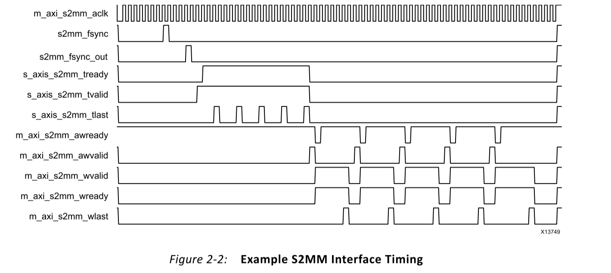
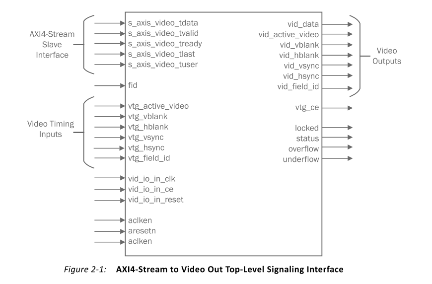

# AXI 协议  
## 1、通道信号  
写请求：携带地址和控制信号  
AWVALID//主机  
AWREADY//从机  
AWADDR  
AWLEN  //突发长度
AWSIZE //突发大小，字节为单位，一次传输的数据量为AWLEN * AWSIZE（Byte）
写数据：携带数据和控制信号  
WVALID//主机  
WREADY//从机  
WDATA  
WLAST//主机  
写相应  
BVALID//从机  
BREADY//主机  
读请求  
AWVALID//主机  
AWREADY//从机  
ARADDR  
读数据  
RVALID//从机  
RREADY//主机  
RLAST//从机  
除了写相应和读数据通道，其他都是VALID为主机，RAEADY为从机  

## 状态机
  
```
always @ ( posedge M_AXI_ACLK)                                                                            
	  begin                                                                                                     
	    if (M_AXI_ARESETN == 1'b0 )                                                                             
	      begin                                                                                                                               
	        mst_exec_state      <= IDLE;                                                                
	        start_single_burst_write <= 1'b0;                                                                   
	        start_single_burst_read  <= 1'b0;                                                                   
	        compare_done      <= 1'b0;                                                                          
	        ERROR <= 1'b0;   
	      end                                                                                                   
	    else                                                                                                    
	      begin                                                                                                                                                                              
	        case (mst_exec_state)                                                                               
	                                                                                                            
	          IDLE:                                                                                                                                                       
	            if ( init_txn_pulse == 1'b1)                                                      
	              begin                                                                                         
	                mst_exec_state  <= INIT_WRITE;                                                              
	                ERROR <= 1'b0;
	                compare_done <= 1'b0;
	              end                                                                                           
	            else                                                                                            
	              begin                                                                                         
	                mst_exec_state  <= IDLE;                                                            
	              end                                                                                           
	                                                                                                            
	          INIT_WRITE:                                                                                                                                                                   
	            if (writes_done)                                                                                
	              begin                                                                                         
	                mst_exec_state <= INIT_READ;//                                                              
	              end                                                                                           
	            else                                                                                            
	              begin                                                                                         
	                mst_exec_state  <= INIT_WRITE;                                                              
	                                                                                                            
	                if (~axi_awvalid && ~start_single_burst_write && ~burst_write_active)                       
	                  begin                                                                                     
	                    start_single_burst_write <= 1'b1;                                                       
	                  end                                                                                       
	                else                                                                                        
	                  begin                                                                                     
	                    start_single_burst_write <= 1'b0; //Negate to generate a pulse                          
	                  end                                                                                       
	              end                                                                                           
	                                                                                                            
	          INIT_READ:                                                                                                                                                                   
	            if (reads_done)                                                                                 
	              begin                                                                                         
	                mst_exec_state <= INIT_COMPARE;                                                             
	              end                                                                                           
	            else                                                                                            
	              begin                                                                                         
	                mst_exec_state  <= INIT_READ;                                                               
	                                                                                                            
	                if (~axi_arvalid && ~burst_read_active && ~start_single_burst_read)                         
	                  begin                                                                                     
	                    start_single_burst_read <= 1'b1;                                                        
	                  end                                                                                       
	               else                                                                                         
	                 begin                                                                                      
	                   start_single_burst_read <= 1'b0; //Negate to generate a pulse                            
	                 end                                                                                        
	              end                                                                                           
	                                                                                                            
	          INIT_COMPARE:                                                                                                                                                                                
	            begin                                                                                           
	              ERROR <= error_reg;
	              mst_exec_state <= IDLE;                                                               
	              compare_done <= 1'b1;                                                                         
	            end                                                                                             
	          default :                                                                                         
	            begin                                                                                           
	              mst_exec_state  <= IDLE;                                                              
	            end                                                                                             
	        endcase                                                                                             
	      end                                                                                                   
	  end
```
## 2、数据传输握手协议  
VALID 和 READY信号握手  
## 3、写请求过程  
写相应通道的握手只有 一个时钟周期，目的主要是将写地址传递给从机，并且握手成功自增突发长度*数据位宽（Byte）的长度  
```
 always @(posedge M_AXI_ACLK)                                   
	  begin                                                        
	    if (M_AXI_ARESETN == 0 || init_txn_pulse == 1'b1 )                                           
	      begin                                                            
	        axi_awvalid <= 1'b0;                                           
	      end                                                                 
	    else if (~axi_awvalid && start_single_burst_write)                 
	      begin                                                            
	        axi_awvalid <= 1'b1;                                           
	      end                                                                    
	    else if (M_AXI_AWREADY && axi_awvalid)                             
	      begin                                                            
	        axi_awvalid <= 1'b0;                                           
	      end                                                              
	    else                                                               
	      axi_awvalid <= axi_awvalid;                                      
	    end  
```
## 4、写数据过程  
在WVALID和WREADY都有效时写入数据，在最后一个信号写入后拉低WVALID信号
```
assign wnext = M_AXI_WREADY & axi_wvalid;                                                  
	  always @(posedge M_AXI_ACLK)                                                      
	  begin                                                                             
	    if (M_AXI_ARESETN == 0 || init_txn_pulse == 1'b1 )                                                        
	      begin                                                                         
	        axi_wvalid <= 1'b0;                                                         
	      end                                                                                               
	    else if (~axi_wvalid && start_single_burst_write)                               
	      begin                                                                         
	        axi_wvalid <= 1'b1;                                                         
	      end                                                                                                   
	    else if (wnext && axi_wlast)                                                    
	      axi_wvalid <= 1'b0;                                                           
	    else                                                                            
	      axi_wvalid <= axi_wvalid;                                                     
	  end
```
握手周期持续直到最后一个数据写入，WLAST信号在写到突发长度-2时拉高，因为要延迟一个时钟周期  
```
always @(posedge M_AXI_ACLK)                                                      
	  begin                                                                             
	    if (M_AXI_ARESETN == 0 || init_txn_pulse == 1'b1 )                                                        
	      begin                                                                         
	        axi_wlast <= 1'b0;                                                          
	      end                                                                           
	    else if (((write_index == C_M_AXI_BURST_LEN-2 && C_M_AXI_BURST_LEN >= 2) && wnext) || (C_M_AXI_BURST_LEN == 1 ))
	      begin                                                                         
	        axi_wlast <= 1'b1;                                                          
	      end                                                                                                       
	    else if (wnext)                                                                 
	      axi_wlast <= 1'b0;                                                            
	    else if (axi_wlast && C_M_AXI_BURST_LEN == 1)                                   
	      axi_wlast <= 1'b0;                                                            
	    else                                                                            
	      axi_wlast <= axi_wlast;                                                       
	  end   
```
## 5、写响应过程  
BREADY持续拉高，BVALID在从机接收到完整数据后拉高，两者共同拉低当握手成功  
## 6.读请求和读数据
与写请求和写数据类似
  
## 7.注意
在自己创建的AXI IP核中，默认突发长度为16，突发大小为32字节4Byte，每次突发64Byte，写计数器为七位，当最高位为1时停止写  
所以一共写了64次，64*64 = 4KB  
```
reg [C_NO_BURSTS_REQ : 0] 	write_burst_counter;  

if (M_AXI_BVALID && (write_burst_counter[C_NO_BURSTS_REQ]) && axi_bready)                          
	      writes_done <= 1'b1;   

parameter integer C_M_AXI_BURST_LEN	= 16,
parameter integer C_M_AXI_DATA_WIDTH	= 32,
localparam integer C_MASTER_LENGTH	= 12;   

localparam integer C_NO_BURSTS_REQ = C_MASTER_LENGTH-clogb2((C_M_AXI_BURST_LEN*C_M_AXI_DATA_WIDTH/8)-1);  //12 - log2((16 * 32 / 8) - 1) = 6
//求位宽函数
function integer clogb2 (input integer bit_depth);              
	  begin                                                           
	    for(clogb2=0; bit_depth>0; clogb2=clogb2+1)                   
	      bit_depth = bit_depth >> 1;                                 
	    end                                                           
	  endfunction   
```  
# AXI Stream Video 协议
## 1.输入接口信号：  
s_axis_video_tdata DATA  
s_axis_video_tvalid VALID  
s_axis_video_tready READY  
s_axis_video_tuser SOF:Start Of Frame   
s_axis_video_tlast EOL:End Of Line  
输出接口信号与输入接口信号相似，为主接口：m_axis_video_tdata  
## 2.TKEEP and TSTRB默认值为1  
## 3.帧起始及握手信号  
  
SOF在成功握手后拉低，表示第一个像素已发送  
## 4.帧结束信号  
  
在一行的最后一个像素点拉高
# AXI DMA
为外设和系统内存的直接数据访问提供桥梁，解放了CPU在内存读取方面的工作  
## 接口

AXI4 Stream Master (MM2S) MemoryMap to Stream  
存储器映射（AXI-4 Full）到AXI-4 Stream  

AXI4 Control Stream (MM2S) Stream to MemoryMap  
AXI-4 Stream到存储器映射（AXI-4 Full） 
## （简单DMA）Direct Register Mode配置顺序  
通过访问DMACR，源地址或目的地址和长度寄存器发起传输。  
启动顺序：  
1.开始使能MM2S通道  
2.使能中断  
3.写有效源地址到MM2S_SA寄存器，如果没有使能DRE，则需要地址对齐 
地址对齐是指：指定的传输地址必须为传输数据位宽的整数倍
4.写传输的字节数到MM2S_LENGTH寄存器  
一个长度为0的值是无效的，非零值会决定寄存器映射到Stream的数据个数  
必须最后一个配置MM2S_LENGTH寄存器，其他寄存器配置顺序没有要求  
## IP核信号  
  
# VDMA + VIDEO OUT + VTC + HDMI  
  
## VDMA
  
### 1、DDR读信号及时序  

信号：   
mm2s_fsync MM2S 帧同步输入  
m_axis_mm2s_tlast ：行结束信号  
mm2s_frame_ptr_out(5:0) : 读取 (MM2S) 通道帧指针输出。指示在读哪个帧缓存  
mm2s_introut：内存映射至流通道的中断输出  
m_*_t信号是AXI Stream信号，含义与AXI 相似  
读取的数据通过行缓存转换成流数据  
在这里，MM是指DDR，S指流向的目的地  
MM2S为读 S2MM为写  
AXI VDMA 部分接口说明：
S_AXI_LITE： AXI-Lite 接口， PS 通过这个接口配置 VDMA 的寄存器；  
s_axi_lite_aclk： AXI VDMA AXI4-Lite 接口时钟；  
M_AXI_MM2S：读通道存储器端映射的 AXI4 接口，提供对存储器（ DDR3）的访问；  
m_axi_mm2s_aclk： AXI VDMA MM2S 时钟；  
M_AXIS_MM2S：读通道 AXI-Stream 端映射的 AXI4 接口，用于输出到外设；  
m_axis_mm2s_aclk： AXI VDMA MM2S AXIS 时钟；  
mm2s_introut：读通道中断输出信号。  
### 2、写信号
  
接收到 s2mm_fsync 后，AXI VDMA 驱动 s2mm_fsync_out 和 s_axis_s2mm_tready 以指示其已准备好在流接口上接收帧。  
输入的流数据存储在行缓冲区中，而后写入DDR。
### 3、启动流程  
  
以下以MM2S模式讲解，即从DDR读取模式  
1.如果是MM2S模式，往偏移地址为0x00写入，将VDMARS.RS置1  
如果要打开中断寄存器第13位拉高  
打开RS第0位拉高  
  
2.往BaseAddr + 0x5c写入帧缓存的起始地址，即从DDR中读取的起始地址    
3.写入行有效数据字节步长，指每条视频行的第一个像素之间的地址字节数。  
  
4.往base + 0x54写入行字节大小  
5.往0x50写入列一共有多少行  
```
	//VDMA基地址
	#define VDMA_BASE_ADDR XPAR_AXI_VDMA_0_BASEADDR
	//DDR程序首地址
	#define MEMORY_BASE	XPAR_PS7_DDR_0_S_AXI_BASEADDR
	//写入图片缓存的DDR首地址，加上偏移量是为程序运行空间留内存  
	unsigned int srcBuffer = (MEMORY_BASE  + 0x1000000);
	//字节指针，指向DDR中内存
	u8 * baseaddr = (u8 *)srcBuffer;

	Xil_Out32(VDMA_BASE_ADDR,0x1);
	Xil_Out32(VDMA_BASE_ADDR+0x5c,srcBuffer);
	Xil_Out32(VDMA_BASE_ADDR+0x58,STRIDE * 3);
	Xil_Out32(VDMA_BASE_ADDR+0x54,HPIXEL * 3);
	Xil_Out32(VDMA_BASE_ADDR+0x50,VPIXEL);
```
## AXI4-Stream to Video Out
需要和VTC一起使用
  
VTC支持两种模式：  
主模式：  
VTC自由运行
从模式：  
VTC 发生器时钟使能来控制 AXI4-Stream 输入和 VTC 之间的相位差，以实现低延迟应用。  
一般建议使用从模式
  
### 1、信号列表
vid_io_out_ce : 本地时钟启用，一般是输出端时钟，与AXI-Stream时钟相区别  
fid : AXI4-Stream 总线的字段 ID。仅用于隔行扫描视频：0=偶数场，1=奇数场。默认悬空  
vtg_ce:VTC 时钟使能。用于停止定时发生器以实现同步目的。  
模块中：FIFO深度：当FIFO读空时会导致时序错误，所以一般设置较大的值（1024）
## VTC
VTC时序图  
  
行场同步信号都是正极性，当行场同步信号为负极性时，结果如下：  
  
## 1、接口与模式

det_clken : VTC Detection有效时钟使能  
gen_clken ：VTC Generator有效时钟使能
fsync_in : FRAME SYNCHRONIZATION INPUT 帧同步输入  
intc_if : OPTIONAL EXTERNAL INTERRUPT CONTROLLER INTERFACE 可选的外部中断控制器接口  
## 2、配置  
  
Include AXI4-Lite Interface: 允许动态编程和更改处理显示参数。  
Include INTC Interface：允许中断  
Interlaced Video Support:选择后，启用隔行视频检测或生成  
Synchronize Generator to Detector or to fsync_in:选择后，定时发生器会自动与检测器或 fsync_in 输入端口同步。  
  
Active Size:行有效宽度  
Frame Size：行总数  
Sync Start:行起始时间，按照VTC时序图中为有效宽度+前沿  
Sync End：行结束，有效宽度+前沿+同步
  
场同步同理  
Vblank Start = Vblank End = VSync Start = Vsync End = Active Size  

