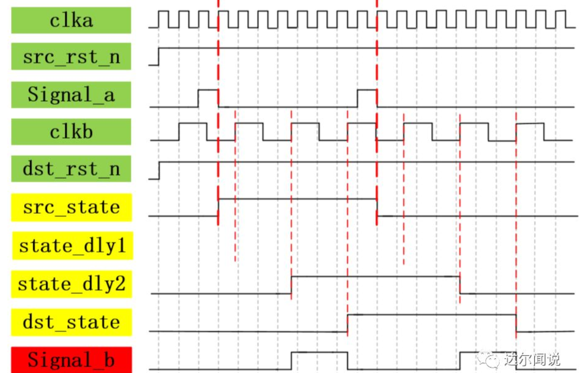
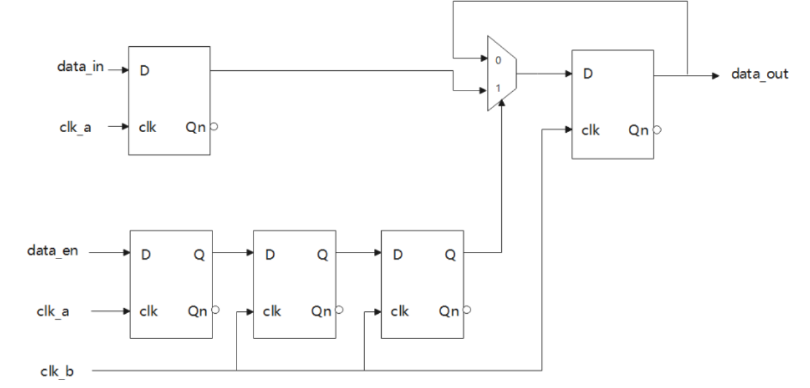

## 1.如果存在时序违例，它们有何影响？可以如何修复？

解题思路：时序违例分为2类：建立时间违例和保持时间违例。 简历时间违例的发生，会导致数据没有充足的时间在时钟上升沿到来之前做好准备，从而可能导致采集到的数据不正确。 建立时间违例的修复方法有以下2种： （1）改用速度更快的器件，降低触发器时钟边沿到数据输出端的响应时间，以增大留给建立时间的时间余量。 （2）缩短电路中的逻辑。如果在电路中2级D触发器之间的组合逻辑电路逻辑深度过深或者逻辑过长，可以考虑分步进行，将一段长的逻辑分成两个或者多个步骤分别实现，以减小每个时钟周期内Tp-logic逻辑运算时间，从而增大留给建立时间的时间余量。 保持时间违例的发生，会导致前一个周期的数据尚未打入后一级电路就被冲掉。 保持时间违例的修复方法有以下4种： （1）改用速度慢一些的器件，增加器件响应时间，从而增大Tcq时间，以增大留给保持时间的时间余量。 （2）加长2级D触发器中组合逻辑电路中的逻辑，加长逻辑运算时间Tp-logic。以增大留给保持时间的时间余量。 （3）加延迟缓冲。如可以加2级反相器。在不影响原有逻辑的基础上，加大数据传播所需要的时间，从而增大留给保持时间的时间余量。 （4）降低器件电压（不推荐）

## 2.亚稳态产生的原因是什么？它稳定之后的结果是确定的吗？

解题思路：产生的原因：在数字电路中，如果数据传输的过程中不满足建立时间和保持时间，或者是复位信号释放不满足恢复时间，则电路会产生亚稳态。 亚稳态稳定之后的结果：亚稳态需要经过大于等于决断时间的时间之后才会回到一个确定的状态，但是这个结果是随机地稳定到0或者1上。

## 3.AXI4总线有哪些通道，为什么会没有读响应通道

解题思路：AXI4总线包括以下5个通道：写地址通道、写数据通道、写响应通道、读数据通道、读地址通道。 没有读响应通道的原因：因为读数据通道可以从接收端接收到数据，因此它也有AXI4读响应功能，因此不需要再额外开辟一条读响应通道。

## 4.数字IC设计的全流程包括哪些步骤？

解题思路：市场调研->模块分配->RTL编写->功能仿真->逻辑综合->形式验证->STA（静态时序分析）->布局规划->插入时钟树->布线->布线后的STA->LVS、DRC检查

## 5.两段式状态机和三段式状态机有何不同？

解题思路：两段式状态机有两个always块： 一个采用时序电路描述状态的转移方式，即当前状态和协议状态的跳转。另一个采用组合逻辑电路来输出相应状态的数据。 三段式状态机有三个always块： 一个采用时序电路描述当前状态和协议状态的跳转。一个采用组合逻辑电路来描述下一状态的转移条件，第三个采用组合逻辑电路来输出相应状态的数据。

## 6.异步FIFO当中为什么要使用格雷码？

解题思路：为了能够使得在电路发生亚稳态等异常的时候能够使得FIFO的判空和判满不会发生致命的错误。二进制码在进做判空或判满操作时，数据的所有bit位都会发生变化。如果地址变化的时候，由于时钟发生抖动等因素造成了亚稳态，最后稳定下来，地址的每一个bit都会随机地稳定到0或者1，如对于一个深度为4的FIFO而言，若此时写入地址为010，那么下一次写入的地址应该是011，并且是为满的状态。但是若发生亚稳态，则有地址可能编程100或者010，造成地址的超前或者滞后，并且判空判满做出了错误的判断。而使用格雷码，因为每一次只有一个bit的数据发生变化，所以地址的变化即使发生了亚稳态，也不会对FIFO的工作产生致命性错误。在地址变化的过程中，若发生亚稳态，此时地址只可能是不变化或者是变成正常情况下的下一地址2种情况，最坏的情况只会是它本身，把上一次写的数据给覆盖掉，FIFO的判空和判满不会发生致命的错误。依旧以深度为4的FIFO举例，若此时地址所对应的格雷码为11（对应十进制的地址2），它的下一状态应该是10，并且是满状态。若发生了亚稳态，最坏情况就是把11种的数据替换掉，而不会发生地址超前或者滞后的情况。因此对FIFO的空满判断不会造成致命的影响。

## 7.latch是如何产生的，如果在时序电路中会不会产生latch？

解题思路：Latch只会发生在组合逻辑电路中。如果在组合逻辑电路中的代码书写逻辑不完整，如有if没有else，有case没有default，就会产生latch。Latch对于时序分析非常不友好。如果一个模块中既有时序电路，又有组合逻辑电路，尽量避免latch的产生。在时序电路中不会产生latch。

## 8.在FPGA中，BRAM和DRAM有什么区别？

解题思路：BRAM是块RAM，在FPGA中是以块为单位出现，它的输出需要给时钟。BRAM在FPGA中是一种单独的定制资源，它对时序分析相较于DRAM要友好得多。但是它是以块为单位出现的，即使使用了BRAM中的一小部分，这块BRAM就无法再次使用。DRAM是分布式RAM，它是使用FPGA中的LUT（查找表资源）来进行搭建的，因此DRAM会占用FPGA中的LUT资源。DRAM不需要时钟进行驱动，并且使用较为灵活，可以定制任意大小的DRAM。 一般而言，少量数据使用DRAM存储，大量数据采用BRAM存储。对时序要求高的电路使用BRAM。

## 9。FPGA的资源有哪些？

解题思路（1）IOB可编程输入输出单元 （2）可编程逻辑块 （3）数字时钟管理模块 （4）BRAM （5）布线资源 （6）底层内嵌功能单元——PLL（锁相环）、DSP等 一般会针对LUT、BRAM和DRAM进行深入提问

## 10.reg型和always块变量可以用在组合逻辑电路中吗？

解题思路：reg型和always块变量可以用在组合逻辑电路中。此时always块的写法不再是时序电路中由时钟来进行驱动，而是写成always@(*)。此后reg型变量在always块中进行运算即可。

## 1、硬件描述语言和软件编程语言的区别

  硬件描述语言是一种用形式化的方法来描述数字电路和系统的语言。数字电路的设计者利用这种语言可以从上层到下层逐层描述自己的设计思想，用一系列分层次的模块来表示及其复杂的数字系统。然后利用电子设计自动化(EDA)工具来进行仿真验证，再把其中需要变为具体物理电路的模块组合经由自动综合工具转换到门级电路网表，再用专用集成电路(ASIC)或者现场可编程门阵列(FPGA)自动布局布线工具把网表转换为具体电路布线结构的实现，通俗点说，自己来设计内部电路。而软件编程语言是没法改变电路结构的，因为芯片内部已经固化，所以软件编程操作意味着是对内部寄存器的操作。
## 2、FPGA选型问题

  关于FPGA如何选芯片，其实就是根据项目实际情况，对选型芯片做一个综合评估，选择出最具“性价比”的芯片，一般情况下，芯片厂商都会按照产品系列列出所有的产品，直观的告诉你某个系列产品的应用场合。如何选择芯片厂商，要看项目的特殊需求、芯片厂商的供货、报价、以及己方的技术人员对产品的熟悉程度和芯片的成熟度，比如说是不是有较好的软件开发平台呀，还有就是芯片的内部资源，引脚封装、速度等级等。
3、建立时间和保持时间问题

  建立时间Tsu： 指数据信号到达触发器输入端的时间要早于 时钟敏感边沿 到达触发器的时间，只有满足建立时间，信号才能正确的保存到触发器，否则数据就不能在此时钟信号变化时被记录，从而无法正确保存到触发器。简言之，时钟沿到来之前，数据保持稳定不变的时间。
  保持时间：指 时钟边沿 到达后 输入数据 需要保持稳定不变的时间，满足这个条件，才能保证数据能够保存到触发器，否则，数据就不能在下一个时钟信号变化时被记录下来，导致无法正确的保存到触发器。简言之，时钟沿到来之后，数据保持稳定不变的时间。
  综述：输入的数据必须在建立时间前达到，且要持续到保持时间后。
## 3、亚稳态问题

  亚稳态：输入信号在时钟有效沿的建立时间和保持时间之间变化，导致其不满足触发器建立保持时间的时序要求，使得输出有一段时间的不确定状态。
  亚稳态现象包括如下几种：
  1、跨时钟域中的亚稳态：由于源信号时钟与目的信号时钟的相移未知，可能导致保持时间和建立时间条件不满足，从而产生亚稳态现象。——采用FIFO对跨时钟域数据通信进行缓冲设计。
  2、异步信号中的亚稳态：由于异步信号不与触发器同步时钟同步，所以可能导致保持时间和建立时间条件不满足，产生亚稳态现象。—— 通过同步处理来解决。
  3、异步复位检测中的亚稳态：复位信号的变化出现在建立或者保持时间内，也无法保证满足Tsu和Th的要求，出现亚稳态。——对复位电路采用异步复位、同步释放方式处理。
## 4、竞争和冒险问题

  竞争(Competition): 在组合逻辑电路中，某个输入变量通过多条（两条及以上）途径传到输出端，由于每条途径延迟时间不同，到达输出门的时间就有先有后，这种现象称为竞争。
  冒险(risk)：信号在器件内部通过连线和逻辑单元时，都有一定延时。多路信号在电平值变化时也都存在不同的延迟，对应的组合逻辑的输出也就有了先后顺序，因此就产生了冒险。
	冒险现象中会出现一些不正确的尖峰信号，称为"毛刺"。
  竞争和冒险都是由于存在电路延迟引起的，同时冒险是由竞争造成的，而竞争是因为电路中的时延不同，但是有竞争的时候不一定会出现冒险。解决方法：1：加滤波电路，消除毛刺的影响；2：加选通信号，避开毛刺；3：增加冗
余项消除逻辑冒险。
## 5、乒乓操作问题

  乒乓操作是一个主要用于数据流控制的处理技巧，外部输入数据流通过“输入数据选择控制”模块送入两个数据缓冲区中，数据缓冲模块可以为任何存储模块，比较常用的存储单元为双口RAM（Dual RAM），SRAM，SDRAM，FIFO等。在第1个缓冲周期，将输入的数据流缓存到“数据缓冲1”模块，在第2个缓冲周期，“输入数据选择控制”模块将输入的数据流缓存到“数据缓冲2”模块的同时，“输出数据选择控制”模块将“数据缓冲1”模块第一个周期缓存的数据流送到“后续处理”，模块进行后续的数据处理，在第三个缓冲周期，在“输入数据选择控制”模块的再次切换后，输入的数据流缓存到“数据缓冲1”模块，与此同时，“输出数据选择控制”模块也做出切换，将“数据缓冲2”模块缓存的第二个周期的数据送到“后续处理模块”，如此循环。这里正是利用了乒乓操作完成数据的无缝缓冲与处理，乒乓操作可以通过“输入数据选择控制”和“输出数据选择控制”按节拍，相互配合地进行来回切换，将经过缓冲的数据流没有停顿的送到“后续处理模块”。
## 6、同步和异步逻辑电路

  同步逻辑：时钟之间有着固定的因果关系，且触发只和时钟有关，只要在时钟沿处才能触发。
  同步电路： 同步电路中所有触发器的时钟端连接在同一时钟源上，所有触发器状态的改变都与时钟信号同步。因此当时钟沿到来则输出变化，否则保持，直到下一时钟脉沿到来才发生变化。
  异步逻辑：时钟之间没有固定的因果关系，其触发和多种控制因素有关，当任何一个因素发生变化，那么都能实现触发。
  异步电路中没有统一的时钟。有些触发器的时钟输入端与时钟源相连，只有这些触发器的状态变化与时钟脉冲同步，而其他的触发器的状态变化不与时钟脉冲同步。
  总结：同步逻辑和异步逻辑不是完全割裂的，异步逻辑中肯定有同步逻辑的成分在，但同步逻辑中不可能有异步逻辑的成分。
## 7、同步复位和异步复位

  同步复位：复位信号与clk有效，当clk有效的时候，复位才有效。
  优点：有利于进行时序分析；由于只在clk有效的时候有效，因此能防止毛刺现象的出现。
  缺点：复位信号必须大于时钟周期，才能被系统真正识别；大部分逻辑器件中的D触发器都只有异步复位端口，因此采用同步复位的话，需要在寄存器的数据输入端插入组合逻辑，此时我们就需要考虑组合逻辑延迟等因素。
  异步复位：复位信号与clk无关，只和自身输入的复位信号有关。
  优点：大部分逻辑器件中的D触发器都只有异步复位端口，无需再插入组合逻辑，省资源；设计相对简单；
  缺点：复位信号可能不满足建立和保持时间要求，因此容易出现亚稳态；容易受毛刺影响；
## 8、MOORE 与 MEELEY 状态机的特点

  Moore 有限状态机输出只与当前状态有关，与输入信号的当前值无关。在时钟脉冲的 有效边沿作用后的有限个门延后，输出达到稳定值。从时序上看，Moore 状态机属于同步输出状态机。Moore 有限状态机最重要的特点就是将输入与输出信号隔离开来。
  Mealy 状态机的输出是现态和所有输入的函数，随输入变化而随时发生变化。从时序上看，Mealy 状态机属于异步输出状态机，它不依赖于时钟。
## 9、同步和异步FIFO

  同步FIFO：读写都是同一个时钟源；异步FIFO：读写不是同一个时钟源。

  最常见的就是异步FIFO的问题，因为异步FIFO会存在如下几种情形：
  ### 1、写时钟快于读时钟，写和读的过程中没有空闲周期
  答：假设写时钟频率为80MHz,读时钟频率为50MHz,突发传输大小为120，写和读的过程中没有空闲周期，分析过程：写时钟周期Tw = 1000/80 ns = 12.5ns;同理读时钟周期为20ns；突发写长度为120个数据，写120个数据耗时120 * 12.5 = 1500ns；1500ns时间内读出数据1500/20ns = 75个；故最小FIFO深度为120 - 75 = 45。

  ### 2、写时钟频率大于读时钟频率，但在读写的过程中存在空闲周期
  答：假设写时钟频率为80MHz,读时钟频率为50MHz,突发传输大小为120，写和读的过程中有空闲周期，每2个写时钟周期写1个数据，每4个时钟周期读一个数据，那么写一个数据需要25ns,读一个数据需要80ns，那么由于突发写数据个数为120个，写这么多数据需要时间120 * 25ns = 3000ns；4个读时钟周期读一个数据，因此读一个数据需要时间80ns，3000ns读了3000/80 = 37.5个数据（0.5不算一个数据，没读完整），约等于37个数据。
所以，FIFO的最小深度为120 - 37 = 83。

  3、写时钟慢于读时钟，且读写过程中没有空闲周期
  答：假设写时钟频率为30MHz,读时钟频率为50MHz,突发传输大小为120，写和读的过程中没有空闲周期，分析：这种情况下永远也不会发生数据丢失的情况；fifo的深度为1。

  4、写时钟频率小于读时钟频率，但读写过程中存在空闲周期
  答：假设写时钟频率为30MHz,读时钟频率为50MHz,突发传输大小为120，写和读的过程中有空闲周期，每2个写时钟周期写1个数据，每4个时钟周期读一个数据，分析：写时钟周期1000/30 ns = 100/3 ns;读时钟周期 20ns；写一个数据需要2个时钟，也就是200/3 ns；读一个数据需要4个时钟，也就是80 ns；写120个数据需要时间8000ns，这段时间内读出数据8000/80 = 100个；
因此，FIFO的最小深度为120 - 100 = 20；

  5、读写时钟速率相同，且无空闲时钟
  答：分析：如果读写时钟之间没有相位差，则不需要FIFO就可以进行读写；如果二者存在相位差，只需要FIFO的深度为1即可。

  6、读写时钟频率一致，但在读写过程中存在空闲周期
  答：读写时钟均为50MHz,突发传输大小为120，写和读的过程中有空闲周期，每2个写时钟周期写1个数据，每4个时钟周期读一个数据，分析：两个时钟写一个数据，需要时间40ns；4个时钟读一个数据，需要80ns；由于突发长度120，需要120*40 = 4800ns写完；这段时间读出数据个数：4800/80 = 60；所以，FIFO最小深度为120 - 60 = 60；
### 1
1.input delay和out delay和怎么约束，这两个跟什么有关系。  
set_input_delay 25 -max -clock MCLK [get_ports DATAIN]  
set_input_delay 5 -min -clock MCLK [get_ports DATAIN]  

Input Delay是以上游芯片的时钟发送沿为参考，上游的输出数据到达FPGA的外部输入端口之间的延迟。  
输入延迟（input delay）包括Tco和Trace Delay（板间延迟），其中Trace delay又叫Board delay。   
```
上级芯片到fpga 端口称作为input delay：
把他们想象成经典时序模型，下面有两种情况：
1.记输出到fpga的data和clk是同时到达的，理想状态 T_su和Th是上游期间的触发器参数
此时： input delay max = t - T_su ； 形象化理解下：采集周期减去数据产生建立的时间 即理想化最大延时，也能满足fpga建立的要求
input delay min = Th ； 在保证最大延时下，min值一定可以满足，所以在pt分析时发现改变min值对路径时间无影响
t:为latch - lunch的间隔时间

2.记上级输出到fpga的data 和 clk是不同时间到达呢：
此时 ： input delay max = t - tsu -(t_data_min - t_clk _max_max)
input delay min = Th +(t_data_max - t_clk_min)
这个区间都是告诉fpga内部，外部输入信号 clk 和data 的相位关系。

```
### 2
如何保证以太网输入数据和时钟是对齐的。
跨时钟域处理：  
单比特信号
1.慢时钟域到快时钟域  
打两拍  
2.快时钟域到慢时钟域  
先在原时钟域展宽信号再采样  

```
module a (
    input   wire        clka,
    input   wire        clkb,
    input   wire        rstna,
    input   wire        rstnb,
    input   wire        a,

    output  reg         b
);

reg     flag;

reg     flagb;
always @(posedge clka or negedge rstna) begin
    if(!rstna)
        flag <= 'd0;
    else if(a)
        flag <= ~flag;
    else
        flag <= flag;
end

always @(posedge clkb or negedge rstnb) begin
    if(!rstnb)
        flagb <= 'd0;
    else
        flagb <= flag;
end

reg     reg1;
reg     reg2;
reg     reg3;
always @(posedge clkb or negedge rstnb) begin
    if(!rstnb)begin
        reg1 <= 'd0;
        reg2 <= 'd0;
        reg3 <= 'd0;
    end
    else begin
        reg1 <= flagb;
        reg2 <= reg1;
        reg3 <= reg2;
    end
end

wire    o;
assign  o = reg2 ^ reg3;

endmodule //a
```
3.多bit信号同步  

```
`timescale 1ns/1ns

module mux(
	input 				clk_a	, 
	input 				clk_b	,   
	input 				arstn	,
	input				brstn   ,
	input		[3:0]	data_in	,
	input               data_en ,

	output reg  [3:0] 	dataout
);
reg		[3:0]	data_in_reg;
reg			data_en1;
reg			data_en2;
reg			data_en3;

always@(posedge clk_a or negedge arstn)begin
	if(!arstn)
		data_in_reg <= 'd0;
	else 
		data_in_reg <= data_in;
end

always@(posedge clk_a or arstn)begin
	if(!arstn)
		data_en1 <= 1'b0;
	else
		data_en1 <= data_en;
end

always@(posedge clk_b or negedge arstn)begin
	if(!arstn)
		begin
			data_en2 <= 1'b0;
			data_en3 <= 1'b0;
		end
	else
		begin
			data_en2 <= data_en1;
			data_en3 <= data_en2;
		end
end

always@(posedge clk_b or negedge arstn)begin
	if(!arstn)
		dataout <= 'd0;
	else if(data_en3 == 1'b1)
		dataout <= data_in_reg;
	else
		dataout <= dataout;
end
endmodule
```
### 3 
FPGA你是怎么进行资源评估的？
FF和LUT的数目：

这个在写出具体代码之前，初学者通常没法估算，但资深FPGA工程师会估算出一个数量级。通常的做法是系统架构划分好后可以复用的模块根据以前设计中的资源消耗数来估，新的模块写完代码后估。

RAM：

这块在实现架构定好后，基本能准确地估出来，各个模块需要用到几个FIFO，几个RAM，最终整个系统的RAM数量可以确定。前提是所有功能的实现方式设计好。

乘法器：

这个与上面RAM的估法一致。

锁相环，时钟分配器，时钟资源：

这部分在系统设计架构完成后，根据各个模块的时钟频率来确定。

IO管脚数目：

这部分其实是和需求强相关的，基本上需求确定好，实现方式确定好。

特殊IO：

这部分的估算有时候和硬件接口相关，有时候和实现方式相关。举例来说，LVDS的数目通常由对接的硬件器件确定，而DDR部分需要根据系统实现方式来确定，确定DDR的带宽，频率，接口的位宽等，这样对DDR IP CORE的需求也就出来了。

总之，在经验不足的情况下更常用的做法是现在一块比较大的开发板上实现主要功能，然后在综合工具上综合后，直接看资源。  

### 4
FPGA中LUT跟触发器中的比例? 
每四个6输入的查找表加2个触发器以及一个进位加法运算器组成一个slice，两个slice组成一个CLB单元。  
### 5
DDR的数据传输速率跟什么有关？
DDR速率分析：由于ddr输入的实际物理宽度，即input进来的数据宽度为32bit。在ddr3的IP核中设置的clock period为800M（由于DDR在时钟上升都传输数据），所以实际传输速率为1600Mbit/s。所以总速率为1600*32=51200Mbit/s=6400Mbyte/s=6.25Gbyte/s。（由于ddr的axi接口时钟位宽为256bit，因此uiclk=1600*32/256=200M）。
### 6
异步FIFO怎么减少数据出错？
异步FIFO在复位一段时间后，才可以继续操作，不可以复位后立马把读写使能拉高，因为异步FIFO需要一定的时间进行同步操作。  
FIFO复位后需要一些时钟之后，才可以进行正常的读写工作。  
异步FIFO写数据需要经过10个左右的时钟才能从正确读出，这里一定要流出足够的时钟周期，否则会发生错误。  
### 7
怎么定义一个接口是高速接口呢？


