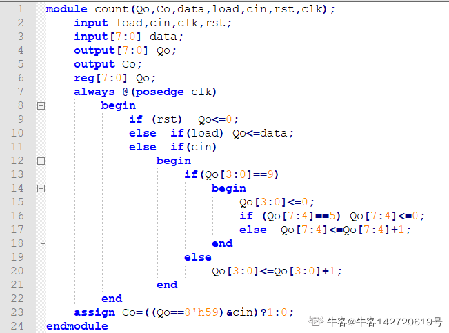
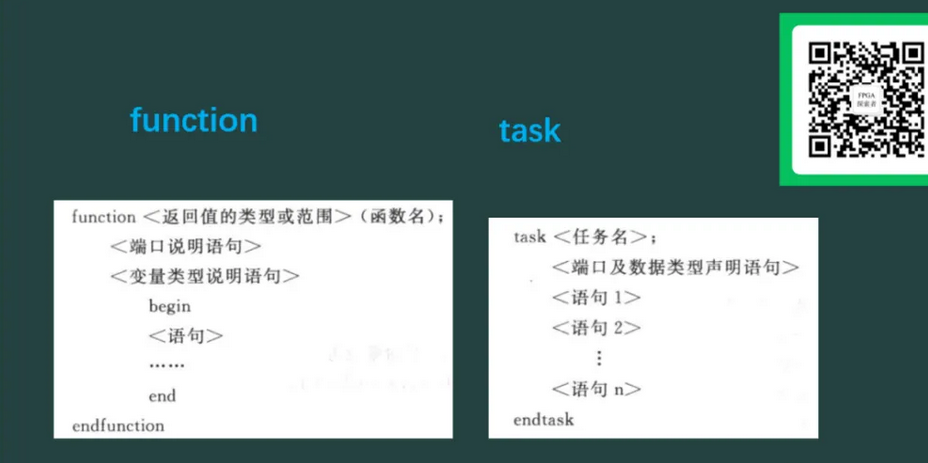
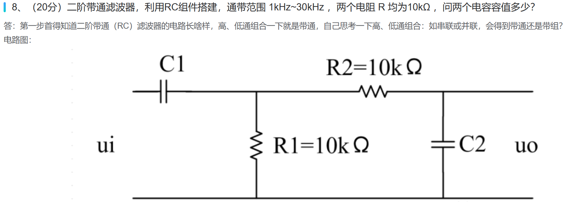
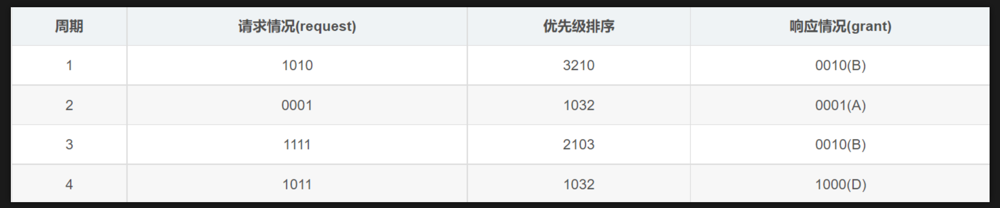

1.
下列关于FPGA功耗与时序约束说法错误的是
A
在 CMOS 电路中，静态功耗主要是漏电流引起的功耗，往往与工艺有关。
B
流水线设计能降低功耗
C
通过划分不同时钟域可以优化系统时序
D
信号能否正常读取只取决于信号的建立时间

d

4.
在FPGA设计中，关于亚稳态问题说法不正确的是 ：
A
亚稳态问题通常发生在一些跨时钟域信号传输以及异步信号采集上
B
采用FIFO对跨时钟域数据通信进行缓冲设计可以消除亚稳态
C
采用流水线的设计可以消除亚稳态
D
对复位电路采用异步复位、同步释放方式处理可以解决亚稳态复位时的不稳定

c

5.
假设一个4bit计数器工作在36MHz时钟域下，要把此计数器的值传递到另一异步100MHz时钟域，以下方式不正确的是（ ）
A
锁存+握手信号
B
使用DMUX（数据分配器）电路
C
使用格雷码
D
使用异步FIFO
正确答案：C
官方解析：

两个时域之间通过请求和应答信号线进行握手，时域A发送请求发送数据信号req，同时是准备好数据；时域B接收到时域A发送的请求信号后，回应一个应答信号ack，同时将数据接收进行寄存；时域A接收到应答信号后重新发送请求信号req，进行第二个数据传输，依次直到完成时域A数据发送完成。但是要注意程序设计，不正确的程序设计将会发生数据漏取（快时域到慢时域）或者插入数据（慢时域到快时域），所以A选项正确。

7.
指令系统中程序控制类指令的功能是？（ ）
A
实观主存与CPU之间的数据传送
B
实现程序执行顺序的改变
C
实现算术和逻辑运算
D
实现堆栈操作

b

8.
现有表达式Y = C ? A : B；如果C = x或z，A=1010，B=1100时，Y为（ ）？
A

1010
B

1xx0
C

1100
D

x11x

b

9.
移位寄存器由 16 级触发器组成，用它构成的扭环形计数器具有（ ）种有效状态；用它构成的环形计数器具有（ ）种有效状态。
A
32，16
B
16，16
C
32，32
D
16，32

a

10.
在Verilog中，关于函数不正确的是（ ）
A
函数可以调用其它函数
B
函数只能返回一个值
C
可以包含时延或者时序控制
D
函数必须带有至少一个输入
正确答案：C
官方解析：

在Verilog语言中，函数只能在模块中定义，位置任意，并在模块的任何地方引用，作用范围也局限于此模块。函数主要有以下几个特点：

- （1）不含有任何延迟、时序或时序控制逻辑；

- （2）至少有一个输入变量；

- （3）只有一个返回值，且没有输出；

- （4）不含有非阻塞赋值语句；

- （5）函数可以调用其他函数，但是不能调用任务；任务可以调用函数。

### 11
Verilog 中 10%(-3) 的结果是多少？
A
3
B
-3
C
1
D
-1
正确答案：C
官方解析：

Verilog 里的取模运算，即求余数运算，先把各自符号位去掉运算，然后取第一个运算数的符号位。

### 12
只使用2选1的数据选择器实现异或逻辑，最少需要（ ）个数据选择器
A
1
B
2
C
3
D
4
正确答案：B

### 13
下列不属于静态时序分析的时序路径的是（ ）
A
模块外部输入->第一级寄存器数据输入
B
寄存器的时钟引脚->模块外部输出
C
模块外部输入->模块外部输出
D
寄存器数据输出->模块外部输出
正确答案：D
官方解析：

静态时序分析的时序路径包含以下四种：模块外部输入->第一级寄存器数据输入、寄存器的时钟引脚->寄存器数据输入、寄存器的时钟引脚->模块外部输出、模块外部输入->模块外部输出。

### 14
下列CMOS电路功耗类型中属于动态功耗的是（ ）
A

状态转换瞬间MOS管的导通功耗
B
PN节上反向漏电流产生的功耗
C
对容性负载充放电产生的功耗
D
流过截止晶体管的亚阈值泄漏电流
正确答案：AC
官方解析：

功耗是门电路重要参数之一。功耗有静态和动态之分。

所谓静态功耗是指电路输出没有状态转换时的功耗。静态时，CMOS电路的电流非常小，使得静态功耗非常低。CMOS反相器在静态时，P、N管只有一个导通。由于没有Vdd到GND的直流通路，所以CMOS的静态功耗应该等于零。但实际上，由于扩散区和衬底的PN结上存在反向漏电流，所以会产生静态功耗。

CMOS电路在输出发生状态转换时的功耗称为动态功耗。它主要由两部分组成。一部分是电路输出状态转换瞬间MOS管的导通功耗。当输出电压由高到低或由低到高变化过程中，在短时间内，NMOS管和PMOS管均导通，从而导致有较大的电流从电源经导通的NMOS管和PMOS管流入地。

动态功耗的另一部分是因为CMOS管的负载通常是电容性的，当输出由高电平到低电平，或者由低电平到高电平转换时，会对电容进行充、放电，这一过程将增加电路的损耗。

### 15
主存和Cache包含哪几种映射方式（ ）
A
直接相联映射
B
间接相联映射
C
全相联映射
D
组相联映射
正确答案：ACD
官方解析：

主存和Cache主要有三种地址映射方式，分别为全相联映射、直接相联映射和组相联映射

### 16
片上系统（SoC）也称为系统级芯片，下面关于SoC叙述中错误的是（ ）。
A
LR目标函数是最小化后验概率
B
LR目标函数是最小化先验概率
C
SoC芯片中只有一个CPU或DSP
D
SoC芯片可以分为通用SoC芯片和专用SoC芯片两大类
E
专用SoC芯片可分为定制的嵌入式处理芯片和现场可编程嵌入式处理芯片两类
F
FPGA芯片可以反复地编程、擦除、使用，在较短时间内就可完成电路的输入、编译、优化、仿真，直至芯片的制作
正确答案：AC

### 17

在下列Verilog代码中，a=11, b=10，则z的运算结果为：
input [3:0] a;
input [3:0] b;
output signed [7:0] z;
 
wire signed [3:0] c;
assign c = a[3:0] * b[3:0];
assign z = c;

 在运算中，只要是有无符号数参与，就按无符号数运算；

（1）输入的 a 和 b 都是无符号数，所以进行无符号数的乘法，11 和 10 也在输入的表示范围内，执行 11*10 =110；

（2）使用 8 位表示是 0110_1110；

（3）c 只有 4 bit ，所以直接截取低 4 位为 1110；

（4）将其赋值给 z 后，由于 z 是有符号数，且 c 的最高位符号位为 1，所以进行符号位的扩展，得到 1111_1110，该数表示 -2。

为什么表示 -2？

（1）该数目前是补码表示，去掉最高位的符号位为 111_1110；

（2）取反，000_0001；

（3）加 1，得到 000_0010，该数表示2；

（4）符号位为 1，表示负数，所以是 -2；

### 18
下面运算符，优先级最高的是
A
%
B
||
C
！
D
&&
正确答案：C
官方解析：

！，~                    高优先级

*，/，%

+，-

<< , >>

< , < = , > , > =

= = , != , = = = , != =

& ,  ~&

^  ,  ^ ~

| , ~ |

&&

||

? :                     低优先级 
优先级的划分如下，从前到后优先级逐渐降低： 
1.算数运算符： !   ~                        *   /   %                         +    - 
2.移位运算符：  <<   >> 
3.关系运算符:    <=   <     >    >= 
4.等式运算符：    ==    ！=   ===   ！== 
5.缩减运算符:      &   |    ^   ^~ 
6.逻辑运算符:&&   ||，注意不包括逻辑非！ 
7.条件运算符:     ？ : 
8.拼接运算符:   {}     


### 19
将十进制数1002.456转换为八进制数（要求转换误差不大于2-4），结果是（ ）
A
3EA.6
B
3EA.7
C
1752.34
D
1753.03
正确答案：C
官方解析：

可先将十进制数1002.456转换为二进制数，1002转换为二进制数是1111101010，0.456转换为二进制数过程如下：

0.456*2 = 0.912   ------0

0.912*2 = 1.824   ------1

0.824*2 = 1.648   ------1

0.648*2 = 1.296   ------1

所以，0.456转换为二进制结果为：0.0111，转换误差不大于2-4

所以十进制数1002.456转换为二进制数结果是1111101010.0111，然后将二进制结果转换为八进制结果为：1752.34。

### 20

关于Verilog中操作符描述错误的是（）
A
<<的优先级大于<
B
条件操作符优先于拼接操作符
C
/>>>逻辑右移，左边补0
D
使用“==”比较二值逻辑，如果出现X或者Z，则结果为X
正确答案：C
官方解析：
/>>>是算术右移，考虑符号位，如果是0，则左边补0，如果是1，则左边补1

### 21
在verilog语言中，关于函数（function）与任务（task）说法不正确的是：
A
任务可以调用函数
B
任务中可以包含任何时序控制语句
C
函数不能单独作为一条语句出现，只能放在赋值语言的右端
D
任务可以作为一条单独的语句出现语句块中

正确答案：B
官方解析：函数只能调用函数，不能调用任务，但任务可以调用函数 是对的
B 任务不能出现 always 语句，但可以包含其他时序控制，如延时语句

### 22

观察下面的代码，说明下面的代码会产生（）区间的随机数。
reg [23:0] rand;
rand = {$random} %60;
A
-59~59
B
-59~60
C
0~59
D
0~60
正确答案：C
官方解析：
$random的一般用法为：
1、$random %b，其中b>0。它给出了一个范围在（-b+1):(b-1)中的随机数。
2、{$random} %b，其中b>0。它给出了一个范围在0:(b-1)中的随机数。 

### 23
乘法器通常有四种实现方法，并行乘法器，移位相加乘法器，查找表乘法器，加法树乘法器，下列关于乘法器描述错误的是（）
A
并行乘法器是在verilog直接用*表示，这种乘法器要用综合工具得到乘法结果
B
并行乘法器耗用资源多
C
移位相加乘法器是从被乘数的最低位开始判断，若为1，则乘数左移i(i=0,1(width-1))位后，与上一次和进行相加，若为0，则乘数左移i位后，以0相加。直到被乘数的最高位
D
移位相加乘法器实际由移位和加法运算完成，占用资源少，串行并行速度都快
正确答案：D
官方解析：

移位相加法实现乘法的优点是占用的资源较少；缺点是速度比较慢，一个结果的输出需要花费多个时钟周期，在高位宽乘法运算中极为明显

### 24
 系统任务$finish的作用是退出仿真器，返回主操作系统，也就是结束仿真过程。任务$finish可以带参数，根据参数的值输出不同的特征信息。如果不带参数，默认$finish的参数值为1。请问当$finish的参数值为2时，系统输出的特征信息是（）
A
不输出任何信息
B
输出当前仿真时刻和位置
C
输出当前仿真时刻、位置和在仿真过程中所用memory及CPU时间的统计。
正确答案：C
官方解析：
当参数值为0时，特征信息为：不输出任何信息
当参数值为1时，特征信息为：输出当前仿真时刻和  位置
当参数值为2时，特征信息为：输出当前仿真时刻、位置和在仿真过程中所用memory及CPU时间的统计。

### 25
观察下面的各个选项，找出其中正确的选项。
A
任务会有返回值
B
函数至少有一个输入变量
C
函数可以定义自己的仿真时间单位
D
函数可以启动任务
正确答案：B
官方解析：
函数返回一个值，而任务则不返回值。所以A是不正确的。
函数至少要有一个输入变量，而任务可以没有或有多个任何类型的变量。所以B正确。
函数只能与主模块共用同一个仿真时间单位，而任务可以定义自己的仿真时间单位。所以C是不正确的。
函数不能启动任务，而任务能够启动其他任务和函数。所以D是不正确的。 

### 26

上面是对一个同步复位，同步置数，clk上升沿计数，模为60的bcd码加法器，运行下面的仿真后，答案错误的是（）
always 10 clk=~clk;
initial begin
clk=0;load=0;cin=0;rst=1;data=8'h50;
#20 rst=1;
#20 rst=0;load=1;
#20 rst=0;load=0;
#20 rst=0;load=0;cin=1;
#220
finish;
end
A
在第40个时钟单位时，Qo=00
B
在第60个时钟单位时候，Qo=50
C
在第140个时钟单位时候，Qo=53
D
在第255个时钟单位时候，Co=0
正确答案：D
你的答案：C
官方解析：在第80个时钟单位时，Cin等于1时候，计数器开始计数，在90的时钟上升沿时开始变化，此后每20个时钟单位加1，当Qo等于59时，20*8=160+90=250产生进位，所以在255时钟时候Co等于1

### 27
移位相加乘法器所占用的资源是所有类型乘法器中最少的，在低速的信号处理中有广泛的使用， 四位二进制乘法采用移位相加的方法。即用乘数的各位数码, 从高位开始依次于被乘数相乘, 每相乘一次得到的积称为部分积, 将第一次得到的部分积高位补0并与第二次得到的部分积左移一位后相加得到P1, 将加得结果高位补0再与第三次得到的部分积左移一位相加得到P2……直到所有的部分积都被加过一次。当两个四位数R和Q分别是1101和1011时，下列说法错误的是（）
A
第一次运算P1是R和Q最低位的第一次运算的结果，它应该是1101
B
第三次运算P3它应该是100011
C
如此重复的动作可以写为循环，循环内先判断Q[0]是否为1，如果是，{P[8],P[7:4]}=P[7:4]+R,再移位P和Q。
D
4位移位相加乘法器，循环的次数为4
B

### 28
编码方式描述错误的是（）
A
格雷码是其循环和单步特性消除了随机取数时出现重大错误的可能，是一种可靠性编码，是一种错误最小化的编码方式
B
独热编码又称一位有效编码，状态译码简单，但不易于修改，增加状态或改变状态转换条件都影响状态机的其它部分
C
使用格雷编码，则相邻状态转换时只有一个状态位发生翻转，这样不仅能消除状态转换时由多条状态信号线的传输延迟所造成的毛刺
D
独热码任何状态只有1bit为1，其余皆为0，编码密度低
正确答案：B
官方解析：

使用较多的触发器，状态译码简单，可减少组合逻辑且速度较快，这种编码方式还易于修改，因为任何状态只有1bit，所以在增加状态或改变状态转换条件都可以在不影响状态机的其它部分的情况下很方便地实现。 

### 29
 请问{1，0}与下面哪个值相等？
A
2'b01
B
2'b10
C
64'h0000000000000002
D
64'h0000000100000000
正确答案：D
官方解析：位拼接运算符必须指明位数，若不指明则隐含着为32位的二进制数（即整数）

### 30
下面哪个不是 不可综合的verilog语句
A
events
B
force 和release
C
#10
D
instantitation
正确答案：D
官方解析：
instantitation 实例化 可综合
 以#开头的延时不可综合成硬件电路延时，综合工具会忽略所有延时代码，但不会报错。

 event在同步test bench时更有用，不能综合。

 不支持force和release的综合。

### 31
用户定义的原语是从英语User Defined Primitives直接翻译过来的，简称UDP。利用UDP用户可以定义自己设计的基本逻辑元件的功能。下面选项中，关于UDP正确的是（）
A
UDP可以有多个输入端
B
UDP可以有多个输出端
C
UDP的真值表中，可以出现高阻值状态Z。
D
输入端和输出端都可以被定义为寄存器类型变量
正确答案：A
你的答案：B
官方解析：
UDP可以有多个输入端，最多允许有10个输入端。A选项正确。
UDP只能有一个输出端，而且必定是端口说明列表的第一项。B选项错误。
在UDP的真值表项中，只允许出现0，1，X的三种逻辑值，高阻值状态Z是不允许出现的。所以C选项是错误的。
只有输出端才可以被定义为寄存器类型变量。所以D选项是错误的。 

### 32
下列关于generate for循环语句说法错误的是（）？
A
generate-for语句必须用genvar关键字，来定义for的循环变量
B
generate-for中的begin end块名字在同一module中不可重复
C
for循环中的内容必须用begin end块包括起来
D
generate for begin后面的名字可省略不写，但必须将begin end写完整，不可缺少end
正确答案：D
官方解析：

generate-for中的begin end块必须有名字，且在同一module中不可重复；generate-for语句必须用genvar关键字，来定义for的循环变量，不可使用其他整型标量。

### 33
代码$display("%h",14'bx0_1010)的输出结果是（）？
A
xxxa
B
xxXa
C
XXXa
D
XXxa
正确答案：B
官方解析：
如果输出列表中表达式的值包含有不确定的值或者是高阻值，且在输出格式为十六进制的情况下，其结果输出遵循以下原则：
①每四位二进制数为一组代表一位十六进制数；
②如果表达式值相对应的某进制数的部分位为不定值，则该位进制数输出结果为大写的X。
③如果表达式值相对应的某进制数的所有位均为不定值，则该位进制数输出结果为小写的X。 

### 32
 事件A分别在10，20，30发生，而B一直保持在X状态，问在50时Count的值是（）。
    reg [7:0] Count;
    initial begin
        Count=0;
    end
    always begin
        @(A) Count = Count +1;
        @(B) Count = Count +1;
    end
A
1
B
3
C
0
D
不确定
正确答案：A
官方解析：这是因为当A第一次发生时，Count的值由0变1，然后时间控制@(B)阻挡了进程。

### 33
下列关于Verilog动态位宽截取的说法错误的是（ ）
A
vect_testa[4+:3]表示，截取宽度为3，升序截取
B
vect[base+:width]或[base-:width]中，width可变，base必须为常量
C
Verilog的数据截取可采用[ ]或者{ }
D
vect_testb[4-:3] = vect_testb [6:4]
正确答案：BCD
官方解析：
Verilog动态固定宽度截取，vect[base±:width]，base表示起始位，width表示截取宽度，base可变，width必须为常量。
截取使用方括号[]，拼接使用大括号{}。
vect[base+:width]表示升序截取，vect[base-:width]表示降序截取。
选项D，vect_testb[4-:3] = vect_testb [4:2] 

### 34
 观察下面的代码，选出正确的输出结果。
module printval;
    reg [11:0] rl;
    initial begin
        rl=10;
        $display("rl=%0d=%0h",rl,rl);
    end
endmodule
A
rl=10=00a
B
rl=10=0a
C
rl=10=a
D
rl=10=000a
正确答案：C
%0表示用最少位数表示   

### 35
verilog设计中，当发生违例时，下列解决方式错误的是（）
A
发生hold违例，牺牲setup保持hold
B
发生setup违例，修改设计
C
发生hold违例，添加延迟模块（buf），增加数据的延迟
D
发生setup违例，提升工作频率
正确答案：D

### 36
在verilog语言中，关于模块与端口说法不正确的是：
A
模块定义必须以关键字 module 开始，以关键字 endmodule 结束。
B
inout 类型可以声明为 reg 数据类型
C
output 可以声明为 wire 或 reg 数据类型。
D
一个模块如果和外部环境没有交互，则可以不用声明端口列表
正确答案：B
官方解析：解析：input、inout 类型不能声明为 reg 数据类型，因为 reg 类型是用于保存数值的，而输入端口只能反映与其相连的外部信号的变化，不能保存这些信号的值。


### 37 
将十进制数13.613转换成二进制数，要求装换误差小于1%，下面答案正确的是（）
A
1101.10010100
B
1101.1001
C
1101.10011100
D
1101.10011101
正确答案：D
官方解析：

首先根据转换误差确定二进制小数的位数，然后采用基数乘除法转换。

整数部分采用基数除法，反复初2，则13/2=6,余1  6/2=3，余0  3/2=1，余1,所以

（12）D =(1101)B 

小数部分采用基数除法，先确定小数的位数。2-m ≤1%，可求出m≥2/lg2=6.64，m取7，则

0.613*2=1.226 取整数1,    0.226*2=0.452 取整数0， 0.452*2=0.904 取整数0，

0.904*2=1.808 取整数1， 0.808*2=1.616 取整数1， 0.616*2=1.232 取整数1，

0.232*2=0.464 取整数0， 0.464*2=0.928 取整数0

最后的小数大于0.5，根据四舍五入，最后应该取1，因为取七位，所以从第八位开始取，10011101，

0.0011B =1*2-1 +1*2-4+1*2-5 +1*2-6+1*2-8 = 0.61328125 误差0.61328125-0.613=0.00028125≈0.03%
满足要求。

### 38

在 Verilog 中，可以利用函数（关键字为 function）将重复性的行为级设计进行提取，并在多个地方调用，来避免重复代码的多次编写，使代码更加的简洁、易懂。关于函数不正确的是
A
函数可以调用其他函数
B
只有一个返回值或输出
C
不含有非阻塞赋值语句
D
不含有任何延迟、时序或时序控制逻辑

B
function只有一个返回值，且没有输出  

### 39
 下面有A、B两条语句。

A语句为if(flag==1'bx) $display("Yes");

B语句为if(flag===1'bx) $display("Yes");

当flag=1'bx时，判断A、B语句是否执行？
A
A语句执行，B语句也执行
B
A语句执行，B语句不执行
C
A语句不执行，B语句执行
D
A语句不执行，B语句也不执行
正确答案：C
官方解析：
下面是===和==的真值表。
=== 	0 	1 	x 	z
    0 	1 	0 	0 	0
    1 	0 	1 	0 	0
    x 	0 	0 	1 	0
    z 	0 	0 	0 	1

== 	    0 	1 	x 	z
    0 	1 	0 	x 	x
    1 	0 	1 	x 	x
    x 	x 	x 	x 	x
    z 	x 	x 	x 	x
### 40
可以用（）系统任务来显示，应该用非阻塞赋值的变量值。
A
$monitor
B
$strobe
C
$display
D
$write
正确答案：B
官方解析：这是考察的$strobe系统任务的基本知识点。
$display命令的执行是安排在活动事件队列中，但排在非阻赋值赋值数据更新事件之前 
 
  $strobe命令的执行是排在非阻塞赋值数据更新事件之后。 
 
  $display适合用来显示阻塞语句的赋值 
 
  $strobe适合用来显示非阻塞语句的赋值 

  ```
  initial begin
    $dumpfile("dump.vcd");
    $dumpvars;
    a = 4'd2;
    b = 4'd3;
    c = 4'd4;
    #(PERIOD*15) $stop;
  end
  
  always @(posedge clk ) begin
    b <= c;
    a <= b;
    $display("display a = %d", a);
    $strobe("strobe a = %d", a);
  end

输出如下：

# KERNEL: display a =  2
# KERNEL: strobe a =  3
# KERNEL: display a =  3
# KERNEL: strobe a =  4
  ```
### 41
用verilog建立可综合模型的原则，以下不正确的是
A
不使用用户自定义原语
B
混合使用上升沿和下降沿触发的触发器
C
用always过程块描述组合逻辑，应在敏感信号列表中列出所有的输入信号
D
同一个变量的赋值不能受多个时钟控制，也不能受两种不同的时钟条件（或者不同的时钟沿）控制。
正确答案：B
官方解析：

敏感列表里同时带有posedge和negedge

    如：always @(posedge clk or negedgeclk) begin...end
    这个always块不可综合。
故B错误 

### 42
$display函数和$write函数的作用都是用来输出信息。观察下面的选项，选出正确的选项。
A
$display会自动地在输出后进行换行
B
$write会自动地在输出后进行换行
C
两者都不能自动的换行
你的答案：B
官方解析：$display自动地在输出后进行换行，$write则不是这样。

### 43
下列关于case描述，错误的是（）
A

一般来说，使用最多的是CASE语句，casez和casex基本上很少使用
B
case语句的表达式的值有4中情况：0、1、z、x。4种是不同的，故表达式要严格的相等才可以操作分支语句
C
casez语句中的表达式情况有三种：0、1、x。不用关心z，z可以和任何数值相等，即z =0.z= 1,z=x
D

casex语句的表达式情况有二种：0、1、z，不用关心x
正确答案：D
  case是要长得一模一样 
 
  case“z”是无视“z”的位 
 
  case“x”是无视“z”和“x”的位 

### 44
以下哪个选项中的命令不是用于写文件？
A
fmonitor
B
fstrobe
C
fdisplay
D
fdumpfile
正确答案：D
官方解析：
fmonitor、$fstrobe、$fdisplay、$fwrite都是用来写文件的。
dumpfile的作用是选择VCD文件的名称。 

### 45
下列哪一个选项不属于Verilog系统函数和任务（ ）
A
realtime
B
readmemb
C
setup
D
time
正确答案：C
官方解析：

time用来查看当前仿真时刻，返回一个64bit的整数来表示的当前仿真时刻；

realtime和$time的作用相同，$realtime但是返回的时间数字是一个实型数；

readmemb，用来从文件中读取数据到存储器中；

选项C不是verilog定义的系统函数和任务。

### 46
观察下面的选项，选出正确的选项。
A
parameter语句能够在延时的格式说明块中出现
B
由specparam语句进行定义的参数只能是延时参数
C
由parameter语句定义的延时参数只能在延时说明块内使用
正确答案：B
你的答案：A
官方解析：
specparam语句只能在延时的格式说明块中出现，而parameter语句则不能够在延时的格式说明块中出现。所以A选项是错误的。
由specparam语句定义的延时参数只能在延时说明块内使用，而由parameter语句定义的参数则可以在模块内的任何位置说明。所以C选项是错误的。

### 47
下列关于Verilog动态位宽截取的说法错误的是（ ）
A
vect_testa[4+:3]表示，截取宽度为3，升序截取
B
vect[base+:width]或[base-:width]中，width可变，base必须为常量
C
Verilog的数据截取可采用[ ]或者{ }
D
vect_testb[4-:3] = vect_testb [6:4]
正确答案：BCD
你的答案：D
官方解析：
Verilog动态固定宽度截取，vect[base±:width]，base表示起始位，width表示截取宽度，base可变，width必须为常量。
截取使用方括号[]，拼接使用大括号{}。
vect[base+:width]表示升序截取，vect[base-:width]表示降序截取。
选项D，vect_testb[4-:3] = vect_testb [4:2] 

### 48
关于Verilog的task任务说法错误的是（）？
A
任务内可包含延时语句、敏感事件控制语句等事件控制语句
B
可以没有或可以有一个或多个输入、输出和双向端口
C
没有返回值
D
任务内不能出现 always 语句，但可出现initial语句
正确答案：D
1) 函数只能与主模块共用同一个仿真时间单位，而任务可以定义自己的仿真时间单位。    
   2) 函数不能启动任务，而任务能启动其它任务和函数。    
   3) 函数至少要有一个输入变量，而任务可以没有或有多个任何类型的变量。    
   4) 函数返回一个值，而任务则不返回值。

### 49


### 50
大疆2020数字IC）

如下图，一个高速接口的端口电路示意图，要求D端发送数字0/1, DQ端收到相同的数字0/1. VREF电压为比较器数字输出0/1的判决电压。  


（1）S1断开时，DQ端VREF电压需设置为?  

（2）S1连通时，DQ端VREF电压需设置为?  

（3）驱动端发送0时功耗较低，这句话是否正确?为什么?  

备注：VREF电压是AD比较器判0或1的基准参考电压  


1）S1 断开时：

若 D 为 1，Q 端电压为 VDDQ，VREF 小于 VDDQ；

若 D 为 0，Q 端的电压为 0，VREF 要大于 0，因此 0<VREF<VDDQ；

（2）S1 连通时：

若 D 为 1，Q 端电压为 VDDQ /3 ；

若 D 为 0，Q 端的电压为 0，因此 0<VREF<VDDQ/3 。

（3）驱动端为 0 时，NMOS 管导通，反相器输出接地，电阻上没有电流，因此功耗较低。  


### 51
下面 2 幅图分别为图一和图二，都调用了乘法器和加法器，其中 IN，S1，S2，S3 的位宽都为 8 bit，FF 为触发器，请问下面的选项哪个或哪些是正确的？  
  
答案：C

解析：

       图一更省资源，图二的 timing 更好

【资源】

       图一和图二的主要区别在于 FF 寄存器的位置，图一中对输入 IN 寄存，8-bit 位宽，图二中对 IN 和 S1/S2 乘法运算的积做寄存，为了保证乘法运算不溢出，结果位宽需要 16-bit，资源用量不同；


### 52
Assign a = (b[15:0] == 16'hd5) ? 1'b0 : 1'b1；该语句需要几个 4 输入 LUT 实现(    )

A. 2       

B. 3       

C. 4       

D. 5

答案：D

解析：

   LUT（Look up Tabel）查找表，是F PGA 底层的一种资源，本质上是一个 RAM，常常用于实现组合逻辑功能。低端 FPGA 常用的是 4 输入查找表（LUT4），即 4 个输入口，可表示为 16*1 的 RAM（2^4=16，4位地址1位数据），高端 FPGA 使用的 6 输入查找表（LUT6）可表示为 64*1 的 RAM；  
  

### 53
4输入查找表可以堪称一个有4位地址线的       x1的RAM。

答案：16

解析：2^4 = 16
  

### 54
假设两个异步时钟clk_a和clk_b，clk_a=148.5M，clk_b=140M。如图所示，clk_a时钟域中连续1920个16bit的数据通过data_valid标记，有效数据之后，紧接着720个无效数据时钟周期。请问，该数据通过异步fifo同步到clk_b时钟域，异步fifo的最小深度是多少？请写出计算过程。  

对于读写同时进行的FIFO，有一个简便计算公式
FIFO_Depth >= Burst_length -Burst_length* (rd_clk/ wr_clk)*(rd_rate)  
  


### 55
设计一个同步fifo，读写时钟相同，每100个时钟写入10个数据，每10个cycle读出1个数据，计算这个同步FIFO的最小深度。

答案：18

解析：fifo设计中最小深度的要求是不溢出（overflow），考虑极限情况，写入数据最多的时候时候就是需要存储数据最多的时候，也是FIFO深度的下限值，即最小深度。  
背靠背，写入20个数据，花费20个时钟，读出了两个数据，存储深度为18.  


### 56
ModuleA/ModuleB用的是同个Clock, Clock频率80MHz。ModuleA和ModuleB同时启动，ModuleA产生如下周期性的burst数据给ModuleB,一共产生8次burst. burst rate : 1280Mbit/s，burst持续时间1us。burst内部速率均匀，burst周期5us，余下的4us内没有数据。

ModuleB收到启动信号后，需要花10us做初始化，所以先把module A的数据缓存在ModuleB内部的同步FIFO中，同步FIFO位宽32bits,初始化结束后，ModuleB以640 Mbit/s的均匀速度从FIFO中读取数据。在满足功能需求的前提下，为了节省电路面积，要求FIFO size越小越好，以下四个选项的FIFO深度，选项（）的FIFO深度符合要求：

A: 128

B: 64

C: 96

D: 160

答案：A

解析：

考虑最大数据情况，在ModuleB启动的10us内，ModuleA一直在传输数据，一共2us有效数据，需要存储 1280Mbit/s * 2us = 2560bit；在第11us，ModuleA传输数据 1280Mbit/s * 1us = 1280bit，ModuleB读取 640 Mbit/s * 1us = 640 bit，需要存储 1280 - 640 = 640 bit，此时共需存储 2560 + 640 = 3200 bit。

考虑整个读写，前15us共写入 3 * 1280=3840，读取 5*640=3200，只需要存储640，目前设置存储3200，所以满足要求。

综合考虑，最大需要存3200bit，深度需要 3200 / 32 = 100，选A的128较为合适。

### 57

背靠背，写入160个数据花费160个周期，期间读出128个数据，差值为32，答案是B

### 58
（大疆2020芯片工程师校招）组合逻辑电路中的冒险是由于（ ）引起的。

A、电路有多个输出

B.、电路未达到最简

C、逻辑门类型不同

D、电路中的时延

答案：D  

（1）竞争

    在一个组合电路当中，当某一个变量经过两条以上的路径到达输出端的时候，由于每条路径上的延迟时间的不同，到达终点的时间就会有先有后，这一现象称作竞争。

（2）冒险

    在具有竞争现象的组合电路中，当某个变量发生变化的时候，比如说从 1 跳到 0，或者说从 0 跳到 1，如果真值表所描述的逻辑关系或者功能遭受到短暂的破坏，在输出端出现一个不应有的尖脉冲 毛刺，这种现象就叫 冒险。

冒险是由竞争造成的，而竞争是因为电路中的时延不同，所以选D，

冒险是因为电路中的时延问题导致。

但是有竞争的时候不一定会出现冒险。

### 59
1）尽量少使用复位，特别是少用全局复位，能不用复位就不用，一定要用复位的使用局部复位；

（2）如果必须要复位，在同步和异步复位上，则尽量使用同步复位，一定要用异步复位的地方，采用“异步复位、同步释放”；

（3）复位电平选择高电平复位；

异步复位，同步释放  

  

### 60
下列关于多bit数据跨时钟域的处理思路，错误的有（）

A. 发送方给出数据，接收方用本地时钟同步两拍再使用；

B. 发送方把数据写到异步fifo，接收方从异步fifo里读出；

C. 对于连续变化的信号，发送方转为格雷码发送，接收方收到后再转为二进制；

D. 发送方给出数据，发送方给出握手请求，接收方收到后回复，发送方撤销数据。

答案：A

解析：多bit跨时钟域不能简单使用打两拍，打拍后可能数据错乱；  

### 61
 false path是设计中的那些时序弧，其中源寄存器的变化预计不会在特定时间间隔内被目标寄存器捕获。false path可以归类为以下类型。
  

### 62


### 63
  

### 64
欲产生序列信号 11010111，则至少需要 ______级触发器。

A.2

B.3

C.4

D.5

答案：B

解析：

触发器产生序列信号时，计算序列长度N=8，由2^3=8得：至少需要3级触发器；

欲用移位寄存器产生序列信号1101010，则至少需要()级触发器，答案是6。  

### 65
  

### 66


### 67


### 68


### 69



### 70
SV比Verilog强在哪里？OVM、UVM、VMM是什么？

    SV支持面向对象的编程，支持断言的语法，支持更多的数据类型。 VMM：Verification Methodology Manual，由ARM和Synopsys提出的，寄存器解决方案RAL机制； OVM：Open Verification Methodology，Mentor和Cadence共同提出，引进了factory机制； UVM：Universal Verification Methodology，通用验证方法学，Accellera提出的，继承了VMM和OVM的优点，克服了二者的缺点，代表了验证方法学的主流，并得到了三大EDA厂商Cadence、Synopsys和Mentor Graphics的支持。

### 71
 cpu cache miss/hit区别 CPU要访问的数据在Cache中有缓存，称为“命中” (Hit)，反之则称为“缺失” (Miss)。 当运算器需要从存储器中提取数据时，它首先在最高级的cache中寻找然后在次高级的cache中寻找。如果在cache中找到，则称为命中hit；反之，则称为不命中miss。 

### 72
RR轮询仲裁器
    数字IC工程师在使用多主设备的总线过程中，需要考虑到不同主设备申请总线控制权的优先级问题，使用Verilog语言，完成轮询仲裁器，其中输入端为4bit的request，输出端为4bit的独热码grant（独热码意味着只存在4种grant的结果如下1000，0100，0010，0001），默认时总线优先级为A>B>C>D，其中的ABCD分别代表request[0],request[1],request[2],request[3],即从低到高依次排列，根据轮询算法，当其中的某一位被选中后，它在下一次request到来时它的优先级最低（3），而它左边的相邻位优先级变为最高（0），从左边相邻位至最高位，优先级依次降低，回旋至最低位，此为轮询算法，举例如下：
  

```
module round_robin_arb(
    input   clk         ,
    input   rst_n       ,
    
    input  [3:0] request,
    output [3:0] grant
);

    // 存储移位后上一次仲裁结果
    reg  [3:0] last_state;
    always@(posedge clk or negedge rst_n) begin
        if(!rst_n)
            last_state <= 4'b0001;     // 默认值，表示最低位的优先级最高
        else if(|request)
            last_state <= {grant[2],grant[1],grant[0],grant[3]}; // 有仲裁请求，根据上一次的仲裁结果，左移1bit后用于控制新的优先级
        else
            last_state <= last_state;  // 无仲裁请求时，pre_state不更新
    end

    // 如果最左侧几个高优先级主机都为发起仲裁请求，需要从最低位开始轮询。
    // 此处通过两个request拼接，将右侧低位拼接到左侧，即可实现对低位的判断。
    wire [7:0] grant_ext;
    assign grant_ext = {request,request} & ~({request,request} - last_state);

    // 得到的grant_ext必定为一个独热码，但是置高位可能在代表低位的高4bit中，因此进行求或运算
    assign grant = grant_ext[3:0] | grant_ext[7:4];

endmodule

```
### 73


### 74
作者：知芯有道
链接：https://ac.nowcoder.com/discuss/917519?type=2&order=3&pos=1&page=0&channel=-1&source_id=discuss_tag_nctrack
来源：牛客网

03:

one-hot code与二进制代码相比优势主要体现在（）？

A.完成电路速度优势

B.节省电路面积

C.节省功耗

D.成本低


独热码和二进制码的优缺点比较:


二进制码、格雷码使用最少的触发器，但是消耗较多的组合逻辑(用于译码) ;

独热码则正好相反，因为状态比较时仅需要比较一位，从而在一定程度上简化了译码逻辑。虽然在表示同样的状态时，独热码占用较多的位，也就是消耗较多的触发器，但这些额外的触发器占用面积可与译码电路省下来的面积相抵消。

另一方面，对于小型设计gray-code和binary-code编码更有效。对于大型设计，one-hot编码更高效。


答案：Ａ