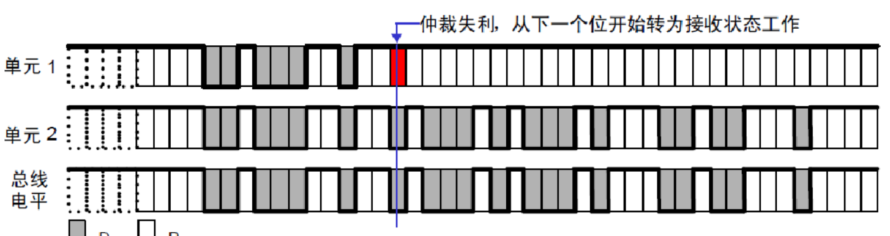

## 型号:EP4CE10
### FPGA的结构
可编程输入输出单元 (IOB)
可编程逻辑单元 (CLB)：FPGA的基本可编程逻辑单元是由查找表（LUT）和寄存器（Register）组成的，查找表完成纯组合逻辑功能。  
完整的时钟管理 (DCM)
嵌入块状RAM (BRAM)
布线资源
内嵌的底层功能单元（soft core，软核，区别于软IP核）和内嵌专用硬件模块（hard core，硬核，区别于硬IP核）。
### 奇偶分频器
## 奇数分频
实现7分频
```
`timescale 1ns/1ns

module odo_div_or
   (
    input    wire  rst ,
    input    wire  clk_in,
    output   wire  clk_out7
    );

//*************code***********//
reg     [2:0]   cnt;
reg             clk_1;
reg             clk_2;
always@(posedge clk_in or negedge rst)begin
    if(!rst)
        cnt <= 'd0;
    else if(cnt == 3'd6)
        cnt <= 3'd0;
    else
        cnt <= cnt + 1'b1;
end
//高电平占3 低电平占4
always@(posedge clk_in or negedge rst)begin
    if(!rst)
        clk_1 <= 1'b0;
    else if(cnt == 3'd3)
        clk_1 <= 1'b1;
    else if(cnt == 3'd6)
        clk_1 <= 1'b0;
    else
        clk_1 <= clk_1;
end

always@(negedge clk_in or  negedge rst)begin
    if(!rst)
        clk_2 <= 1'b0;
    else if(cnt == 3'd3)
        clk_2 <= 1'b1;
    else if(cnt == 3'd6)
        clk_2 <= 1'b0;
    else
        clk_2 <= clk_2;
end
//低电平多一位就是或，高电平多一位就是与
assign clk_out7 = clk_1 | clk_2;
//*************code***********//
endmodule
```
## 偶数分频
```
module divider_six
(
input wire sys_clk , //系统时钟 50MHz
input wire sys_rst_n , //全局复位

output reg clk_out //对系统时钟 6 分频后的信号

);

 reg [1:0] cnt; //用于计数的寄存器

 //cnt:计数器从 0 到 2 循环计数
 always@(posedge sys_clk or negedge sys_rst_n)
	if(sys_rst_n == 1'b0)
		cnt <= 2'b0;
	else if(cnt == 2'd2)
		cnt <= 2'b0;
	else
		cnt <= cnt + 1'b1;

 //clk_out:6 分频 50%占空比输出
 always@(posedge sys_clk or negedge sys_rst_n)
	if(sys_rst_n == 1'b0)
		clk_out <= 1'b0;
	else if(cnt == 2'd2)
		clk_out <= ~clk_out;

 endmodule
```
### 三段式状态机

```
`timescale 1ns/1ns

module fsm1(
	input wire clk  ,
	input wire rst  ,
	input wire data ,
	output reg flag
);
//*************code***********//

reg		[4:0]	state;
reg		[4:0]	next;
reg				flag_reg;
parameter	IDLE	= 5'b00001,
			ONE		= 5'b00010,
			TWO		= 5'b00100,
			THREE	= 5'b01000,
			FOUR	= 5'b10000;


always@(posedge clk or negedge rst)begin
	if(!rst)
		state <= IDLE;
	else
		state <= next;
end

always@(*)begin
	if(!rst)
		next = IDLE;
	else case(state)
		IDLE	:
			if(data == 1'b1)
				next = ONE;
			else
				next = next;
		ONE		:
			if(data == 1'b1)
				next = TWO;
			else
				next = next;
		TWO		:
			if(data == 1'b1)
				next = THREE;
			else
				next = next;
		THREE	:
			if(data == 1'b1)
				next = FOUR;
			else
				next = next;
		FOUR	:
			next = IDLE;
		default	:
			next = IDLE;
	endcase
end

always@(posedge	clk or negedge rst)begin
	if(!rst)
		flag <= 1'b0;
	else if(state == FOUR && data == 1'b1)
		flag <= 1'b1;
	else
		flag <= 1'b0;
end
endmodule
```
## 同步FIFO
读写使用同一个时钟信号，内部内置一个双端口RAM实现数据的存储。
空满标志信号:利用计数器实现，当同时读写则计数器变，当读信号有效并且计数器不为0，则减。
当写信号有效且计数器不为满则递增。
```
always@(posedge clk or negedge rst_n )begin
			if(!rst_n)
				fifo_cnt <= 1'b0;
			else begin
				case ({wr_en,rd_en})
				2'b00 :fifo_cnt <= fifo_cnt ;
				2'b01 :		
					if(fifo_cnt!= 0)
					fifo_cnt <= fifo_cnt -1'b1;
				2'b10:
					if(fifo_cnt != DATA_DEPTH)
					fifo_cnt <= fifo_cnt +1'b1;
				2'b11:
				fifo_cnt <= fifo_cnt ;
				endcase 
			end 
		end 
 
assign full = (fifo_cnt == DATA_DEPTH) ? 1'b1 :1'b0;
assign empty = fifo_cnt == 0 ? 1'b1 :1'b0;
```
## 异步FIFO
深度计算

### 二进制码转格雷码  
assign  gray_code = (bin_code>>1)  ^  bin_code;
### 格雷码转二进制码

```
wire	[3:0]	bin;
wire	[3:0]	gray;
assign bin[3]	= gray[3];
genvar i;
generate
	for(i = 2;i >= 0;i = i - 1)begin:me
		assign bin[i] = gray[i] ^ bin[i + 1];
	end
endgenerate
```
### 空满标志信号
1.当读写指针相等时，表明FIFO为空，这种情况发生在复位操作时，或者当读指针读出FIFO中最后一个字后，追赶上了写指针时。  
2.当读写指针再次相等时，表明FIFO为满，这种情况发生在，当写指针转了一圈，折回来(wrapped around)又追上了读指针  
空满判断：在指针中添加一个额外的位(extra bit)  
如果两个指针的MSB不同，说明写指针比读指针多折回了一次；如r_addr=0000,而w_addr = 1000,为满。  
如果两个指针的MSB相同，则说明两个指针折回的次数相等，其余位也相等，即两个指针相等说明FIFO为空；  
### 当使用格雷码同步时：
对于“空”的判断依然依据二者完全相等(包括MSB)；  
而对于“满”的判断，如下图，由于gray码除了MSB外，具有镜像对称的特点，当读指针指向7，写指针指向8时，除了MSB，其余位皆相同，不能说它为满。  
因此不能单纯的只检测最高位了，在gray码上判断为满必须同时满足以下3条：  
1.wptr和同步过来的rptr的MSB不相等，因为wptr必须比rptr多折回一次。  
2.wptr与rptr的次高位不相等，如上图位置7和位置15，转化为二进制对应的是0111和1111，MSB不同说明多折回一次，111相同代表同一位置。  
3.剩下的其余位完全相等。  
```
`timescale 1ns/1ns

/***************************************RAM*****************************************/
module dual_port_RAM #(parameter DEPTH = 16,
					   parameter WIDTH = 8)(
	 input wclk
	,input wenc
	,input [$clog2(DEPTH)-1:0] waddr  //深度对2取对数，得到地址的位宽。
	,input [WIDTH-1:0] wdata      	//数据写入
	,input rclk
	,input renc
	,input [$clog2(DEPTH)-1:0] raddr  //深度对2取对数，得到地址的位宽。
	,output reg [WIDTH-1:0] rdata 		//数据输出
);

reg [WIDTH-1:0] RAM_MEM [0:DEPTH-1];

always @(posedge wclk) begin
	if(wenc)
		RAM_MEM[waddr] <= wdata;
end 

always @(posedge rclk) begin
	if(renc)
		rdata <= RAM_MEM[raddr];
end 

endmodule  

/***************************************AFIFO*****************************************/
module asyn_fifo#(
	parameter	WIDTH = 8,
	parameter 	DEPTH = 16
)(
	input 					wclk	, 
	input 					rclk	,   
	input 					wrstn	,
	input					rrstn	,
	input 					winc	,
	input 			 		rinc	,
	input 		[WIDTH-1:0]	wdata	,

	output wire				wfull	,
	output wire				rempty	,
	output wire [WIDTH-1:0]	rdata
);
localparam	NUM	= $clog2(DEPTH);

reg		[NUM:0]	wr_ptr;
reg		[NUM:0]	rd_ptr;
wire		[NUM - 1:0]	wr_cnt;
wire		[NUM - 1:0]	rd_cnt;

wire	[NUM:0]	wr_gray;
wire	[NUM:0]	rd_gray;
reg		[NUM:0]	wr_gray_reg;
reg		[NUM:0]	rd_gray_reg;

reg		[NUM:0]	wr2rd_gray;
reg		[NUM:0]	wr2rd_gray_reg;
reg		[NUM:0]	rd2wr_gray;
reg		[NUM:0]	rd2wr_gray_reg;

always@(posedge	wclk or negedge wrstn)begin
	if(!wrstn)
		wr_ptr <= 'd0;
	else if(winc == 1'b1 && wfull != 1'b1)
		wr_ptr <= wr_ptr + 1'b1;
	else
		wr_ptr <= wr_ptr;
end

always@(posedge	rclk or negedge rrstn)begin
	if(!rrstn)
		rd_ptr <= 'd0;
	else if(rinc == 1'b1 && rempty != 1'b1)
		rd_ptr <= rd_ptr + 1'b1;
	else
		rd_ptr <= rd_ptr;
end

assign wr_cnt = wr_ptr[NUM - 1:0];
assign rd_cnt = rd_ptr[NUM - 1:0];

assign	wr_gray = (wr_ptr >> 1) ^ wr_ptr;
assign	rd_gray	= (rd_ptr >> 1) ^ rd_ptr;

always@(posedge wclk or negedge wrstn)begin
	if(!wrstn)
		wr_gray_reg <= 'd0;
	else 	
		wr_gray_reg	 <= wr_gray;
end

always@(posedge rclk or negedge rrstn)begin
	if(!rrstn)
		rd_gray_reg <= 'd0;
	else 	
		rd_gray_reg	 <= rd_gray;
end

//////////full
always@(posedge wclk or negedge wrstn)begin
	if(!wrstn)
		begin
			rd2wr_gray <= 'd0;
			rd2wr_gray_reg <= 'd0;
		end
	else
		begin
			rd2wr_gray <= rd_gray_reg;
			rd2wr_gray_reg <= rd2wr_gray; 
		end
end

assign wfull = (rd2wr_gray_reg == {~wr_gray_reg[NUM:NUM - 1],wr_gray_reg[NUM - 2:0]}) ? 1'b1 : 1'b0;
/////////empty
always@(posedge rclk or negedge rrstn)begin
	if(!rrstn)
		begin
			wr2rd_gray <= 'd0;
			wr2rd_gray_reg <= 'd0;
		end
	else	
		begin
			wr2rd_gray <= wr_gray_reg;
			wr2rd_gray_reg <= wr2rd_gray;
		end
end

assign rempty = (wr2rd_gray_reg == rd_gray_reg) ? 1'b1 : 1'b0;

dual_port_RAM 
#(		.DEPTH(16),
		.WIDTH(8)
		)
RAM(
	.wclk	(wclk)	,
	.wenc	(winc && !wfull)	,
	.waddr 	(wr_cnt),	 //深度对2取对数，得到地址的位宽。
	.wdata 	(wdata)	,	     	//数据写入
	.rclk	(rclk)	,	
	.renc	(rinc && !rempty)	,
	.raddr 	(rd_cnt) ,	//深度对2取对数，得到地址的位宽。
	.rdata 	(rdata)			//数据输出
);
endmodule
```
## HDMI
### 传输原理：TMDS：最小化传输差分信号
### 流程：
1.将24位RGB信号分成三路8bit信号  
2.将8bit信号进行并串转换，再编码成9bit，编码方式为异或运算  
3.添加一位直流均衡成为10bit信号（传输的数据趋于直流平衡，使信号对传输线的电磁干扰减少，提高信号传输的可靠性。）  
4.差分传输  
### 难点：
1.并串转换 & 差分信号转换：  
一、将10bit信号在上升沿和下降沿分别采样，转换成两路5bit信号，（或者直接用assign）    
二、寄存一级后，将寄存后的数据每个周期右移一位，同时将数据的最低位送入DDIO中，生成10bit串行数据
三、在一二同时，将原始10bit信号逐位翻转，重复一二，得到一对差分信号
### 补充
DDIO IP核对于输入的两路数据，上升沿采其中一路，下降沿采另一路 
```
wire [4:0] data_rise = {par_data[8],par_data[6],
par_data[4],par_data[2],par_data[0]};
wire [4:0] data_fall = {par_data[9],par_data[7],
par_data[5],par_data[3],par_data[1]};

//reg define
reg [4:0] data_rise_s = 0;
reg [4:0] data_fall_s = 0;
reg [2:0] cnt = 0;


always @ (posedge clk_5x) 
begin
cnt <= (cnt[2]) ? 3'd0 : cnt + 3'd1;
data_rise_s <= cnt[2] ? data_rise : data_rise_s[4:1];
data_fall_s <= cnt[2] ? data_fall : data_fall_s[4:1];

end

//********************************************************************//
//**************************** Instantiate ***************************//
//********************************************************************//
//------------- ddio_out_inst0 -------------
ddio_out ddio_out_inst0
(
.datain_h (data_rise_s[0] ),
.datain_l (data_fall_s[0] ),
.outclock (~clk_5x ),
.dataout (ser_data_p )
);

//------------- ddio_out_inst1 -------------
ddio_out ddio_out_inst1
(
.datain_h (~data_rise_s[0]),
.datain_l (~data_fall_s[0]),
.outclock (~clk_5x ),
.dataout (ser_data_n )
)
```
## RS232
### 1.RX
TX/RX从低位到高位发送和接收，共8bit数据，1bit起始位，为0；1bit停止位，为1  
波特率为一秒发送的码元数目，每个码元持续时间为1/波特率


## RS485
RS-485 是双向、半双工通信协议，RS-485 采用差分传输方式。  
RS485 相较于 RS232：其抗干扰能力较强，可长距离传输，最大可达上千米，同时 RS-485接口在总线上允许连接多个收发器  

## SPI
### 简介
一种高速、全双工、同步通信总线  
SPI 通讯协议包含 1 条时钟信号线、 2 条数据总线和 1 条片选信号线， 时钟信号线为SCK  
2 条数据总线分别为 MOSI(主输出从输入)、 MISO(主输入从输出)，片选信号线为CS  
### 通讯协议
SPI 通讯协议一共有四种通讯模式， 模式 0、模式 1、模式 2 以及模式 3， 这 4 种模式  
分别由时钟极性(CPOL， Clock Polarity)和时钟相位(CPHA， Clock Phase)来定义  
CPOL 参数规定了空闲状态时 SCK 时钟信号的电平状态  
CPHA 规定了数据采样是在 SCK 时钟的奇数边沿还是偶数边沿  
SPI总线的传输速率一般可以达到小于10Mhz。  
  

## I2C

1.总线通过上拉电阻接到电源。当 I2C 设备空闲时，会输出高阻态，而当所有设备都空闲，都输出高阻态时，由上拉电阻把总线拉成高电平  
2.具有三种传输模式：标准模式传输速率为 100kbit/s ，快速模式为 400kbit/s ，高速模式下可达 3.4Mbit/s，但目前大多 I2C 设备尚不支持高速模式  
3.连接到相同总线的 IC 数量受到总线的最大电容 400pF 限制  
4.器件地址一般位宽为 7 位  
### 协议
1.空闲：SCL 和串行数据信号 SDA 均保持高电平  
2.起始：SCL 依旧保持高电平时， SDA 出现由高电平转为低电平的下降沿，产生一个起始信号  
3.读写：SCL低电平SDA数据更新，高电平数据保持  
4.应答：当一个完整字节的指令或数据传输完成，从机设备正确接收到指令或数据后，会通过拉低 SDA 为低电平  
5.停止：SCL 保持高电平，当串口数据信号 SDA 产生一个由低电平转为高电平的上升沿时， 产生一个停止信号  
### 读/写
控制命令最低位读写控制位，写为0，读为1。控制命令的写入高位在前低位在后  
一、写
1.若为1字节地址，按高位在前低位在后的顺序写入单字节存储地址  
2.若为2字节地址，先向从机写入高 8 位地址，且高位在前低位在后，再写入低 8 位地址
二、读
1.先写读地址，再读数据  
2.数据接收完成后，主机产生一个时钟的高电平无应答信号  

## CAN协议  
1.闭环总线：125 kbps ~1Mbps 的高速 CAN 通信标准。开环总线：10～125 kbps 的低速 CAN 通信标准
2.当CAN_H和CAN_L的电压均为2.5v，两者电压差为0，就规定CAN信号为隐性电平；  
当CAN_H的电压为3.5v，CAN_L的电压为1.5v，两者电压差为2V，就规定CAN信号为显性电平。  
3.在总线空闲状态下，任意节点都可以向总线上发送信息。 
4.此外CAN_H和CAN_L之间需接上120欧姆的终端电阻，主要作用是为了减少信号反射和改善信号质量，增强了抗干扰能力。 
5.CAN总线的传输速率最大是1Mbps   
### 总线仲裁


        CAN（Controller Area Network）总线是一种多主通信协议，允许网络中的多个节点同时尝试发送数据。为了确保在冲突情况下确定性地传输数据，CAN采用了仲裁机制来决定哪个节点可以优先使用总线。这种机制是非破坏性的，这意味着即使一个节点的报文被中断，也不会造成物理层上的错误或需要重传。

        CAN总线仲裁机制的主要步骤：

    并行竞争：当两个或更多的节点在同一时间开始发送报文时，它们的报文起始位和仲裁场同时出现在总线上。
    仲裁段比较：仲裁是基于报文中包含的标识符（ID），ID决定了报文的优先级。ID越小，优先级越高。
    电平判决：显性电平具有高优先级：如果两个节点同时发送相同位（显性位对显性位或隐性位对隐性位），则仲裁继续进行下一个位。但如果一个节点发送显性位而另一个节点发送隐性位，则发送显性位的节点将赢得仲裁，因为显性位具有较高的优先级。  


	在总线空闲态，最先开始发送消息的单元获得发送权。  
	多个单元同时开始发送时，各发送单元从仲裁段的第一位开始进行仲裁。连续输出显性电平最多的单元可继续发送。	  

  
### 位时序
CAN总线的位速率，也称为波特率，指的是每秒钟传输的位数。一个位一般可以分为如下四段：

    同步段（SS）：同步段用于实现发送节点和接收节点之间的同步，确保所有节点都能正确地解释传输的数据
    传播时间段（PTS）：传播时间段用于补偿网络中的物理延迟，确保了所有节点都能在给定的时间内正确地接收和发送数据
    相位缓冲段1（PBS1）：相位缓冲段1位于同步段之后，用于在同步跳变和采样点之间提供一个缓冲区域。这允许接收器有时间来调整其位时间，以便在采样点正确地采样数据。PBS1的长度可以根据网络条件进行调整，以确保最佳的采样性能。
    相位缓冲段2（PBS2）：相位缓冲段2位于采样点之后，用于在采样点和下一个位的开始之间提供一个缓冲区域。这允许发送器有时间来准备下一个要发送的位，并确保接收器有时间来正确地解释已采样的数据。与PBS1一样，PBS2的长度也可以根据网络条件进行调整。
  
### CAN 的同步
硬同步：硬同步是指 CAN 节点在检测到总线上特定的位跳变时进行的同步操作。这些位跳变通常是隐性位（逻辑 1）到显性位（逻辑 0）的变化。  
当一个节点接收到这样的位跳变时，它会根据位跳变的位置来调整自己的采样点，以便与总线上的其他节点保持同步。  
这种同步方式在帧起始信号时同步总线上所有器件的位时序，无法确保后续一连串的位时序都是同步的。  
重新同步：节点检测到总线上的跳变沿不在自己的 SS段范围，那么它会延长 PBS1 段或缩短 PBS2段，以使采样点与总线上的跳变沿重合。  
硬同步：  
  
重新同步：  
  
## 帧类型

### 数据帧  
数据帧和遥控帧有标准格式和扩展格式两种格式。标准格式有 11 个位的标识符（Identifier: 以下称 ID），扩展格式有 29 个位的 ID。  

1.帧起始：标准、扩展格式相同，表示帧开始的段。1 个位的显性位。  
2.仲裁段：表示数据的优先级的段。标准格式和扩展格式在此的构成有所不同。  
3.控制段：控制段由 6 个位构成，表示数据段的字节数。标准格式和扩展格式的构成有所不同。  
4.数据段：标准、扩展格式相同，数据段可包含 0～8 个字节的数据。从MSB（最高位）开始输出。  
5.CRC 段：标准/扩展格式相同，CRC 段是检查帧传输错误的帧。由15 个位的CRC 顺序*1 和1 个位的CRC 界定符（用于分隔的位）构成。  
6.ACK 段：ACK 段用来确认是否正常接收。由ACK 槽(ACK Slot)和ACK 界定符2 个位构成。  
7.帧结束：帧结束是表示该该帧的结束的段。由 7 个位的隐性位构成。   


主动错误标志：6 个位的显性位。  
被动错误标志：6 个位的隐性位。  
错误界定符由 8位的隐性位构成。  

1. 过载标志  
6 个位的显性位。过载标志的构成与主动错误标志的构成相同。  
2. 过载界定符  
8 个位的隐性位。过载界定符的构成与错误界定符的构成相同。  


# USB

## 1. 学习的起点

USB 2.0协议支持3种速率：低速(Low Speed，1.5Mbps)、全速(Full Speed, 12Mbps)、高速(High Speed, 480Mbps)。

USB Hub、USB设备，也分为低速、全速、高速三种类型。一个USB设备，可能兼容低速、全速，可能兼容全速、高速，但是不会同时兼容低速、高速。


### 1.1 USB设备状态切换图


## 2. 电子信号

USB连接线有4条：5V、D+、D-、GND。数据线D+、D-，只能表示4种状态。USB协议中，很巧妙地使用这两条线路实现了空闲(Idle)、开始(SOP)、传输数据(Data)、结束(EOP)等功能。

### 2.3 设备连接与断开

#### 2.3.1 连接

Hub端口的D+、D-都有15K的下拉电阻，平时为低电平。全速设备内部的D+有1.5K的上拉电阻，低速设备内部的D-有1.5K的上拉电阻，连接到Hub后会导致Hub的D+或D-电平变化，Hub根据变化的引脚分辨接进来的是全速设备还是低速设备。

高速设备一开始也是作为全速设备被识别的。

全速设备、高速设备连接时，D+引脚的电平由低变高：

低速设备连接时，D-引脚的电平由低变高：


#### 2.3.2 断开

对于低速、全速设备，接到Hub时导致D-或D+引脚变为高电平，断开设备后，D-或D+引脚变为低电平：


对于高速设备，它先作为全速设备被识别出来，然后再被识别为高速设备。工作于高速模式时，D+的上拉电阻是断开的，所以对于工作于高速模式的USB设备，无法通过D+的引脚电平变化监测到它已经断开。

工作于高速模式的设备，D+、D-两边有45欧姆的下拉电阻，用来消除反射信号：


当断开高速设备后，Hub发出信号，得到的反射信号无法衰减，Hub监测到这些信号后就知道高速设备已经断开


### 2.4 复位

从状态切换图上看，一个USB设备连接后，它将会被供电，然后被复位。当软件出错时，我们也可以发出复位信号重新驱动设备。

那么，USB Hub端口或USB控制器端口如何发出复位信号？发出SE0信号，并维持至少10ms。

USB设备看到Reset信号后，需要准备接收"SetAddress()"请求；如果它不能回应这个请求，就是"不能识别的设备"。


### 2.5 设备速率识别

#### 2.5.1 低速/全速

Hub端口的D+、D-都有15K的下拉电阻，平时为低电平。全速设备内部的D+有1.5K的上拉电阻，低速设备内部的D-有1.5K的上拉电阻，连接到Hub后会导致Hub的D+或D-电平变化，Hub根据变化的引脚分辨接进来的是全速设备还是低速设备。


#### 2.5.2 高速

高速设备必定兼容全速模式，所以高速设备内部D+也有1.5K的上拉电阻，只不过这个电阻是可以断开的：工作于高速模式时要断开它。

高速设备首先作为全速设备被识别出来，然后Hub如何确定它是否支持高速模式？

Hub端口如何监测一个新插入的USB设备能否工作于高速模式？流程如下：

* 对于低速设备，Hub端口不会监测它能否工作于高速模式。低速设备不能兼容高速模式。
* Hub端口发出SE0信号，这就是复位信号
* USB设备监测到SE0信号后，会发出"a high-speed detection handshake"信号表示自己能支持高速模式，这可以细分为一下3种情景
  * 如果USB设备原来处于"suspend"状态，它检测到SE0信号后，就发出"a high-speed detection handshake"信号
  * 如果USB设备原来处于"non-suspend"状态，并且处于全速模式，它检测到SE0信号后，就发出"a high-speed detection handshake"信号。这个情景，就是一个设备刚插到Hub端口时的情况，它一开始工作于全速模式。
  * 如果USB设备原来处于"non-suspend"状态，并且处于高速模式，它会切换回到全速模式(重新连接D+的上拉电阻)，然后发出"a high-speed detection handshake"信号


"a high-speed detection handshake"信号，就是"高速设备监测握手信号"，既然是握手信号，自然是有来有回：

* USB设备维持D+的上拉电阻，发出"Chirp K "信号，表示自己能支持高速模式
* 如果Hub没监测到"Chirp K "信号，它就知道这个设备不支持高速模式
* 如果Hub监测到"Chirp K "信号后，如果Hub能支持高速模式，就发出一系列的"Chirp K"、"Chirp J"信号，这是用来通知USB设备：Hub也能支持高速模式。发出一系列的"Chirp K"、"Chirp J"信号后，Hub继续维持SE0信号直到10ms。
* USB设备发出"Chirp K "信号后，就等待Hub回应一系列的"Chirp K"、"Chirp J"信号
  * 收到一系列的"Chirp K"、"Chirp J"信号：USB设备端口D+的上拉电阻，使能高速模式
  * 没有收到一系列的"Chirp K"、"Chirp J"信号：USB设备转入全速模式


# USB协议层数据格式 #


## 2. 协议层

要理解协议层、理解数据如何传输，带着这几个问题去看文档、看视频：

* 如何寻址设备？
* 如何表示数据方向(读、还是写)
* 如何确认结果？


提前罗列出来：

* USB系统是一个Host对应多个设备，要传输数据首先要通知设备：
  * 发出IN令牌包：表示想读数据，里面含有设备地址
  * 发出OUT令牌包：表示想写数据，里面含有设备地址
* 数据阶段：
  * Host想读数据：前面发出IN令牌包后，现在读取数据包
  * Host想发出数据：前面发出OUT令牌包后，现在发出数据包
* 结果如何？有握手包
  * Host想读数据，设备可能未就绪，就会回应NAK包
  * Host想写数据，它发出数据后，设备正确接收了，就回复ACK包


### 2.1 字节/位传输顺序

先传输最低位(LSB)。在后续文档中，描述数据时按照传输顺序从左到右列出来。


### 2.2 SYNC域

Host发出SOP信号后，就会发出SYNC信号：它是一系列的、最大传输频率的脉冲，接收方使用它来同步数据。对于低速/全速设备，SYNC信号是8位数据(从做到右是00000001)；对于高速设备，SYNC信号是32位数据(从左到右是00000000000000000000000000000001)。使用NRZI编码时，前面每个"0"都对应一个跳变。

在很多文档里，把SOP和SYNC统一称为"SYNC"，它的意思是"SYNC"中含有"SOP"。

### 2.3 包格式


USB总线上传输的数据以包为单位。USB包里含有哪些内容("域")？

* SOP：用来表示包的起始
* SYNC：用来同步时钟
* PID：表示包的类型
* 地址：在USB硬件体系中，一个Host对应多个Logical Device，那么Host发出的包，如何确定发给谁？
  * 发给所有设备：包里不含有设备地址
  * 发给某个设备：包里含有设备地址、端点号

* 帧号、数据等跟PID相关的内容
* CRC校验码


发起一次完整的传输，可能涉及多个包。那么，第1个包里含有设备地址、端点号，后续的包就没必要包含设备地址、端点号。


#### 2.3.1 PID域

注意：所有的USB文档提到的"输入"、"输出"，都是基于Host的角度，"输出"表示从Host输出到设备，"输入"表示Host从设备得到数据。


有哪些USB包？根据包数据里的PID的bit1, bit0可以分为4类：

* 令牌包(Token)：01B
* 数据包(Data)：11B
* 握手包(Handshake)：10B
* 特殊包(Special)：00B

PID有4位，使用bit1,bit0确定分类，使用bit3,bit2进一步细分。如下表(来自《圈圈教你玩USB》)所示：


在USB包中，PID域使用8位来表示，格式如下：


前4位表示PID，后4位是对应位的取反。接收方发现后4位不是前4位的取反的话，就认为发生了错误。


#### 2.3.2 令牌包(Token)

令牌类的PID，起"通知作用"，通知谁？SOF令牌包被用来通知所有设备，OUT/IN/SETUP令牌包被用来通知某个设备。

对于OUT、IN、SETUP令牌包，它们都是要通知到具体的设备，格式如下：


USB设备的地址有7位，格式如下：


USB设备的端点号有4位，格式如下：


对于SOF包，英文名为"Start-of-Frame marker and frame number"。对于USB全速设备，Host每1ms产生一个帧；对于高速设备，每125us产生一个微帧，1帧里有8个微帧。Host会对当前帧号进行累加计数，在每帧或每微帧开始时，通过SOF令牌包发送帧号。对于高速设备，每1毫秒里有8个微帧，这8个微帧的帧号是一样的，每125us发送一个SOF令牌包。

SOF令牌包格式如下：


#### 2.3.3 数据包

Host使用OUT、IN、SETUP来通知设备：我要传输数据了。数据通过"数据包"进行传输。

数据包也有4种类型：DATA0、DATA1、DATA2、MDATA。其中DATA2、MDATA在高速设备中使用。对软件开发人员来说，我们暂时仅需了解DATA0、DATA1。

为什么要引入DATA0、DATA1这些不同类型的数据包？为了纠错。

Host和设备都会维护自己的数据包切换机制，当数据包成功发送或者接收时，数据包类型切换。当检测到对方使用的数据包类型不对时，USB系统认为发生了错误。

比如：

* Host发送DATA0给设备，设备返回ACK表示成功接收，设备期待下一个数据是DATA1
* 但是Host没有接收到ACK，Host认为数据没有发送成功，Host继续使用DATA0发送上一次的数据
* 设备再次接收到DATA0数据包，它就知道：哦，这是重传的数据包

数据包格式如下：


对于全速设备，数据包中的数据做大是1023字节；对于全速设备，数据包中的数据做大是1024字节。


#### 2.3.4 握手包

握手包有4类：ACK、NAK、STALL、NYET

* ACK：数据接收方用来回复发送方，表示正确接收到了数据并且有足够的空间保存数据。
* NAK：Host发送数据给设备时，设备可以回应NAK表示"我还没准备好，没办法接收数据"；Host想读取设备的数据时，设备可以回复NAK表示"我没有数据给你"。
* STALL：表示发生了错误，比如设备无法执行这个请求(不支持该断点等待)、断点已经挂起。设备返回STALL后，需要主机进行干预才能接触STALL状态。
* NYET：仅适用于高速设备。Host可以发出PING包用来确认设备有数据，设备可以回应NYET表示"还没呢"。Hub也可以回应NYET表示低速/全速传输还没完结。


### 2.4 传输细节


#### 2.4.1 传输(Transfer)和事务(Transaction)

USB传输的基本单位是包(Packet)，包的类型由PID表示。一个单纯的包，是无法传输完整的数据。

为什么？比如想输出数据，可以发出OUT令牌包，OUT令牌包可以指定目的地。但是数据如何传输呢？还需要发出DATA0或DATA1数据包。设备收到数据后，还要回复一个ACK握手包。

所以，完整的数据传输，需要涉及多个包：令牌包、数据包、握手包。这个完整的数据传输过程，被称为事务(Transaction)。

有些事务需要握手包，有些事务不需要握手包，有些事务可以传输很大的数据，有些事务只能传输小量数据。

有四类事务：

* 批量事务：用来传输大量的数据，数据的正确性有保证，时效没有保证。
* 中断事务：用来传输周期性的、小量的数据，数据的正确性和时效都有保证。
* 同步事务：用来传输实时数据，数据的正确性没有保证，时效有保证。
* 建立事务：跟批量事务类似，只不过令牌包是SETUP令牌包。


有四类传输(Transfer)：

* 批量传输：就是使用批量事务实现数据传输，比如U盘。
* 中断传输：就是使用中断事务实现数据传输，比如鼠标。
* 同步传输：就是使用实时事务实现数据传输，比如摄像头。
* 控制传输：由建立事务、批量事务组成，所有的USB设备都必须支持控制传输，用于"识别/枚举"


暂时记住这个关系：

* BIT组成域(Field)
* 域组成包(Packet)
* 包组成事务(Transaction)
* 事务组成传输(Transfer)


#### 2.4.2 过程(stage)和阶段(phase)

事务由多个包组成，比如Host要发送数据给设备，这就会涉及很多个包：

* Host发出OUT令牌包，表示要发数据给哪个设备

* Host发出DATA0数据包

* 设备收到数据后，回应ACK包

这个完整的事务涉及3个包(Packet)，分为3个阶段(Phase)：

* 令牌阶段(Token phase)：由令牌包实现
* 数据阶段(Data phase)：由数据包实现
* 握手阶段(Handshake phase)：由握手包实现


事务由包组成，这些包分别处于3个阶段(phase)：令牌阶段，数据阶段，握手阶段。


对于批量传输、中断传输、实时传输，它们分别由一个事务组成，不再细分为若干个过程。


但是控制传输由多个事务组成，这些事务分别处于3个过程：建立过程(stage)、数据过程(stage)、状态过程(stage)。


总结起来就是：

* 控制传输由多个过程(stage)组成，每个过程由一个事务来实现
* 每个事务由多个阶段(phase)组成，每个阶段有一个包来实现


#### 2.4.3 批量传输

批量传输用批量事务来实现，用于传输大量的数据，数据的正确性有保证，时效没有保证。

批量事务由3个阶段(phase)组成：令牌阶段、数据阶段、握手阶段。每个阶段都是一个完整的包，含有SOP、SYNC、PID、EOP。

下图中各个矩形框就对应一个完整的包。


《圈圈教你玩USB》中有详细的示例：


#### 2.4.4 中断传输

中断传输用中断事务来实现，用于传输小量的、周期性的数据，数据的正确性和时效都有保证。

中断事务由3个阶段(phase)组成：令牌阶段、数据阶段、握手阶段。每个阶段都是一个完整的包，含有SOP、SYNC、PID、EOP。

下图中各个矩形框就对应一个完整的包。


中断事务跟批量事务非常类似，Host使用它来周期性地读数据、写数据。

以鼠标为例，我们需要及时获得鼠标的数据，不及时的话你会感觉鼠标很迟钝。但是USB协议中并没有中断功能，它使用"周期性的读、写"来实现及时性。具体过程如下：

* Host每隔n毫秒发出一个IN令牌包
* 鼠标有数据的话，发出DATA0或DATA1数据包给Host；鼠标没有数据的话，发出NAK给Host。


中断事务的优先级比批量事务更高，它要求实时性，而批量事务不要求实时性。


#### 2.4.5 实时传输

实时传输用实时事务来实现，用于传输实时数据，对数据的正确性没有要求。

实时事务由2个阶段(phase)组成：令牌阶段、数据阶段。每个阶段都是一个完整的包，含有SOP、SYNC、PID、EOP。

实时事务不需要握手阶段，一个示例的场景是：为了传输摄像头的实时数据，偶尔的数据错误是可以忍受的，大不了出现短暂的花屏。如果为了解决花屏而重传数据，那就会导致后续画面被推迟，实时性无法得到保证。


下图中各个矩形框就对应一个完整的包。


实时事务跟中断事务非常类似，Host也会周期性的发起实时事务，主要区别在于：

* 实时事务不要求准确性，没有握手阶段
* 实时事务传输的数据量比较大，中断事务传输的数据量比较小


#### 2.4.6 控制传输

在使用批量传输时，使用IN令牌包或OUT令牌包表示数据传输方向。

控制传输的令牌包永远是SETUP，怎么分辨是读数据，还是写数据？发出SETUP令牌包后，还要发出DATA0数据包，根据数据的内容来确定后续是读数据，还是写数据。这个过程称为"建立事务"(SETUP Transaction)


但是控制传输由多个事务组成，这些事务分别处于3个过程：建立过程(stage)、数据过程(stage)、状态过程(stage)。

* 建立过程(stage)，使用SETUP事务：Host发出SETUP令牌包、DATA0数据包、得到ACK握手包
* 数据过程(stage)，使用批量事务：
  * 对于输出：Host发出OUT令牌包，发出DATA0、DATA1数据包、得到ACK握手包
  * 对于输入：Host发出IN令牌包，读到DATA0、DATA1数据包、发出ACK握手包
* 状态过程(stage)，使用批量事务：
  * 对于输出：Host发出IN令牌包，读到DATA1数据包，发出ACK握手包
  * 对于输入：Host发出OUT令牌包，发出DATA1数据包，等待ACK握手包


上图中的每一个方框，都是一个完整的事务，含有：Token Packet、Data Packet、Handshake Packet。


## 3. 使用工具体验数据格式

安装"usbprotocolsuite"后，可以在文档目录里找打很多示程序(后缀名为usb)：


使用"usbprotocolsuite"打开这些文件，即可体验USB数据传输：


## 3. 描述符

怎么描述设备、配置、接口、端点？使用描述符(Descriptors)，有设备描述符、配置描述符、接口描述符、端点描述符。所谓描述符，就是一些格式化的数据，用来描述信息。
一个USB设备，

* 只有一个设备描述符：用来表示设备的ID、它有多少个配置、它的端点0一次最大能传输多少字节数据
* 可能有多个配置描述符：用来表示它有多少个接口、供电方式、最大电流
* 一个配置描述符下面，可能有多个接口描述符：用来表示它是哪类接口、有几个设置(Setting)、有几个端点
* 一个接口描述符符下面，可能有多个端点描述符：用来表示端点号、方向(IN/OUT)、类型(批量/中断/同步)


## AXI协议
AXI4（AXI4-Full）: 满足高性能内存映射（memory-mapped）需求。支持256长度突发（burst）传输。  
AXI4-Lite: 对于简单的、低吞吐量的内存映射通信(例如，与控制寄存器和状态寄存器之间的通信)。不可突发传输。  
AXI4-Stream: 用于高速流数据。不需要地址，允许无限的数据突发大小。
AXI4和AXI4 Lite都包含五个不同的通道：  

    读地址通道（Read Address Channel）  
    写地址通道（Write Address Channel）  
    读数据通道（Read Data Channel）  
    写数据通道（Write Data Channel）  
    写响应通道（Write Response Channel）  


### 写地址通道
负责将地址写入从机
AWVALID 主机
AWREADY 从机
AWADDR
AWKEN 一个burst中传输的个数
AWBURST 突发传输

### 写数据通道
WVALID 主机
WREADY
WADATA
WLAST
WSTRB 数据有效信号

### 写响应通道
BVALID 从机
BREADY 主机
 
### 读地址通道
ARVALID 主机
ARREADY 从机

###读数据通道
RDATA
RVALID 从机
RREADY 主机

### 握手
1.VALID/READY握手才能传输数据和控制信号。这种双向流量控制机制使主从双方都能控制数据和控制信息移动的速率。  
2.在主接口和从接口上的输入和输出信号之间必须没有组合逻辑路径。  
3.为了防止死锁，必须观察握手信号 之间存在的依赖关系。   
	事务中一个AXI组件的VALID信号不能依赖于另一个组件的READY信号。  
	READY信号可以等待VALID信号的断言。  

图中的单箭头表示：箭头两端的信号没有依赖关系，谁先拉高都行；

图中的双箭头表示：箭头起始信号拉高之后，箭头指向的信号才可以拉高。

下图可以看出，读地址的 Valid 和 Ready 两者谁先拉高都可以，读数据的 Valid 和 Ready 两者谁先拉高也没关系，但是读数据必须在读地址完成后才可以拉高。  
  
  


## 图像处理
### γ矫正  
将暗处的目标变得更亮  
实现方式：
LUT，将映射成0-255的表预置到程序中
### 直方图均衡化
如果一幅图像整体偏暗或者偏亮，那么直方图均衡化的方法很适用。  
对一幅灰度图像，其直方图反映了该图像中不同灰度级出现的统计情况。  
步骤：
1.计算原始图像的灰度直方图 nk。  
2.计算原始图像的像素总个数。  
3.计算原始图像的灰度分布频率。  
4.计算原始图像的灰度累积分布频率。  
5.将归一化的 sk 乘以 L−1再四舍五入，以使得均衡化后图像的灰度级与归一化前的原始图像一致。  
6.执行映射  
### sobel
Gx：
-1 0 1  
-2 0 2  
-1 0 1  
Gy：
 1  2  1  
 0  0  0   
-1 -2 -1  
### RGB2HSV


## 操作系统

「通过这次面试经验，你将可以复习到以下知识点」

操作系统的基本职能  
内存管理的基本原理  
连续与非连续内存管理  
分段与分页的区别和联系  
虚拟内存与物理内存的概念  
页表、页框以及地址转换机制  

「面试官」: 同学你好，欢迎来到字节跳动的面试。首先，我们从最基本的开始。能否告诉我，「什么是操作系统」？

「求职者」: 你好，很高兴有这个机会。简单来说，「操作系统是一种软件」。  
 它的职能是作为用户和计算机硬件之间的桥梁，「管理和控制计算机硬件和软件资源的分配与运作」，同时为用户提供一个便捷的交云界面。

「面试官」: 说得不错。那么，我们深入一些，聊聊「内存管理」。你能解释一下内存管理的基本原理是什么吗？

「求职者」: 当然。内存管理的一个基本目标是「优化物理内存的使用」，避免资源浪费。  
 它包括内存的分配与回收机制，以及地址转换等。操作系统通常利用一系列的算法来实现这些功能，以确保每个程序都能高效安全地使用内存。

「面试官」: 很好，接下来谈谈「连续与非连续内存管理」。这两种方式有什么区别？

「求职者」: 在连续内存管理中，每个进程被分配到一个连续的内存块。  
 而非连续内存管理，如页式和段式，允许进程的物理内存分布是分散的。「连续内存管理容易造成内存碎片」，而「非连续内存管理通过页表和段表更高效地利用内存，减少了碎片」。

「面试官」: 非常详细。那么，能否举例说明「页式内存管理」，并解释一下「页框」和「页表」是什么？

「求职者」: 好的。页式内存管理将物理内存划分为固定大小的页框，而将进程的逻辑内存划分为同样大小的页。  
 页式内存管理「使用页表来记录每个页在物理内存页框中的位置，实现虚拟地址到物理地址的映射」。这里有个代码示例：

// 假设这是一个简单的页表数组
int pageTable[] = {2, 4, 1, 3, ...};

// 假设逻辑地址为虚拟页号和页内偏移组合而成
int logicalAddress = getLogicalAddress();
int pageNumber = getVirtualPageNumber(logicalAddress);
int offset = getOffset(logicalAddress);

// 通过页表和偏移量计算物理地址
int physicalAddress = pageTable[pageNumber] * PAGE_SIZE + offset;
这个例子中，pageTable数组模拟了页表，logicalAddress是逻辑地址，我们通过它获得虚拟页号pageNumber和页内偏移offset。  
「页表中存储的是页框号」，我们通过它和页大小PAGE_SIZE相乘，加上偏移量，就可以得到物理地址。

「面试官」: 代码展示得很清晰。那你能进一步解释一下「虚拟地址」和「物理地址」的区别吗？

「求职者」: 当然可以。「虚拟地址是指由操作系统提供给程序的地址」，它为每个程序提供了一个独立的地址空间。  
 这样，每个程序就好像它独占了整个计算机的内存一样。「物理地址则是实际内存条上的地址」，是CPU用来访问内存中实际数据的地址。  
 操作系统和内存管理单元(MMU)共同工作，将虚拟地址转换为物理地址。

「面试官」: 很好，「虚拟地址」带来了哪些好处？

「求职者」: 虚拟地址为系统带来了诸多好处。「首先，它提供了进程间的内存隔离」，各个进程不能直接访问到其他进程的内存。  
 这增加了系统的稳定性和安全性。其次，虚拟地址使得程序编写更为简单，因为程序员无需关心物理内存的实际情况。  
 另外，「它还允许使用虚拟内存技术」，即使物理内存不足，程序也能通过交换空间(swap)在逻辑上使用更多的内存。

「面试官」: 讲得很全面。接下来，告诉我「什么是虚拟内存」，以及它是如何工作的？

「求职者」: 「虚拟内存」是一种内存管理技术，「它允许程序认为自己拥有连续的、足够的内存空间」，即使物理内存不足也不会影响。  
 操作系统会使用部分硬盘空间作为交换空间，「将不常用的数据临时存储到磁盘上」，释放物理内存给其他需要的程序。  
 当这些数据再次需要时，操作系统会负责将其重新加载到物理内存中。这个过程通常是透明的，程序员无需手动管理。

「面试官」: 很详细。现在我们来谈谈页面置换算法。你能说明一下最近最少使用算法（LRU）「和」先进先出置换算法（FIFO）吗？  
「求职者」: 最近最少使用算法（LRU）「是一种页面置换算法，它会跟踪每个页面的使用情况，「在需要进行页面置换时，选择最长时间未被使用的页面进行置  换」。  
这个算法基于的假设是，如果一个页面在最近没有被使用，那么它在未来也不太可能被使用。  
 而」先进先出置换算法（FIFO）**则是最简单的页面置换算法之一，它总是选择最早进入内存的页面进行置换，不考虑各个页面的使用频率。

「面试官」: 明白了。最后让我们讨论一下「颠簸现象」，你能解释一下这是什么现象吗？以及如何解决它？

「求职者」: 「颠簸现象，也称为抖动」，发生在系统为了满足内存请求频繁地进行页面置换的情况下。  
 这会导致系统花费大量时间在页面置换上，降低了实际的工作效率。  
 解决颠簸现象的方法包括「增加物理内存」、「优化页面置换算法」，或者减少同时运行的进程数量，从而减轻系统的内存需求。

「面试官」: 非常棒。有一个问题我们刚才没有详细讨论，那就是「分段与分页的区别」。请你详细区分一下这两种内存管理方式。

「求职者」: 当然可以。「分段」和「分页」是两种不同的非连续内存分配方式。

「分段」是将程序的地址空间分为逻辑上的段，如代码段、数据段和栈段等。  
 它反映了程序的逻辑结构，每个段都是从0开始，长度不等，段的大小由程序决定。

「段表」记录了段的基地址和长度，用于将逻辑地址转换为物理地址。

「分页」则是将程序的地址空间分为固定大小的页，而物理内存也分为同样大小的页框。分页隐藏了程序的逻辑结构，因为它按照固定大小划分，与程序无关。

「页表」用于记录虚拟页和物理页框之间的映射关系。两者的共同点是都能有效地利用内存，减少内存碎片。  
 但是，分段更符合程序员的编程习惯，而分页则是出于内存管理的需要。

「面试官」: 正确。那么，你能解释一下「多级页表」的概念吗？

「求职者」: 「多级页表」是一种解决单级页表因地址空间过大而导致页表过大的问题的方法。在多级页表中，页表本身也被分页。  
 最常见的是二级页表，它将页表分为两级。顶级的页表称为页目录，它的每个条目指向第二级的页表，而第二级页表的每个条目才指向实际的页框。  
 这种方法通过只保持当前需要的部分页表在内存中，减少了内存的使用量。

「面试官」: 很好。最后问一下，你对「交换技术」和「物理内存与虚拟内存之间的关系」有什么看法？

「求职者」: 「交换技术」是指当系统内存不足时，操作系统会将一个进程的全部或部分内存移到磁盘上的交换区，从而为其他进程释放内存。  
 这是虚拟内存技术的一个组成部分。而「物理内存与虚拟内存之间的关系」，  
 简单来说，物理内存是有限的，而虚拟内存通过使用磁盘空间作为内存的延伸来扩展物理内存。  
 虚拟内存使操作系统可以支持更大的地址空间，允许更多的进程同时运行，即使它们的总大小超过了物理内存的容量。

「面试官」: 既然我们已经讨论了内存管理，那么现在我们来聊聊操作系统的资源管理。「你对操作系统资源管理有什么了解」？

「求职者」: 操作系统的资源管理是一个非常广泛的话题，它包括对多种计算机资源的管理，例如CPU、内存、I/O设备和文件系统等。  
「CPU资源管理」，主要涉及到进程调度。操作系统需要决定哪个进程或线程获得CPU的执行时间，以及它们各自执行多长时间。  
 这通常涉及到复杂的调度算法，如先来先服务（FCFS）、短作业优先（SJF）、轮转（RR）和多级反馈队列（MFQ）等。在「内存资源管理」方面，我们已经讨论了分页和分段等内存分配技术，以及虚拟内存等概念。  
 对于「I/O设备管理」，操作系统负责从物理或虚拟设备读写数据，包括管理缓存、队列和设备驱动程序等。  
 最后，「文件系统管理」涉及到文件的存储、组织和检索。操作系统提供了文件创建、删除、读写和权限管理等功能，  
 并通过文件系统抽象来管理磁盘和其他存储设备上的数据。

「面试官」: 非常详细。在CPU资源管理方面，你能解释一下多级反馈队列调度算法（MFQ）的工作原理吗？

「求职者」: 当然可以。「多级反馈队列调度算法」是一种非常灵活的调度算法，它可以根据进程的行为和需求动态调整其优先级。  
 在多级反馈队列中，有多个队列，每个队列都有自己的优先级，以及时间片大小。新进入的进程首先被放入最高优先级的队列。  
 如果一个进程在给定的时间片内未完成，它会被移到下一个优先级较低的队列中。  
 这样，I/O密集型的进程（它们经常由于等待I/O而放弃CPU）会逐渐移向高优先级队列，而CPU密集型的进程则会下降到低优先级队列。  
 这种方式既确保了响应时间，又提供了CPU利用率的优化。

「面试官」: 好的，这节面试就到此为止。你的表现非常出色，非常感谢你今天的分享和讨论。

### 1.谈一谈你对操作系统的理解
操作系统是一种系统软件，它是计算机的一个核心组成部分，负责管理计算机的硬件和软件资源，确保它们得到合理的分配和使用。具体来说，操作系统的主要功能包括进程管理、内存管理、设备管理、文件管理和提供用户接口。

总之，操作系统是计算机中的一个关键组成部分，它负责管理和控制计算机的硬件和软件资源，确保它们得到合理的分配和使用。通过进程管理、内存管理、设备管理、文件管理和用户接口等功能，操作系统为用户提供了一个稳定、高效、安全的计算机环境。

### 2.简单说一下你对并发和并行的理解
在操作系统中，并发通常指的是多个程序在同一处理机上运行，但在任何给定的时刻，只有一个程序在处理机上实际执行。这类似于交替执行不同的任务，虽然从用户的角度来看，它们似乎是同时进行的。  
在操作系统中，并行涉及多个程序段同时在系统中运行，它们的执行在时间上是完全重叠的。并行更强调任务的同时运行，而不仅仅是时间上的重叠。  

### 3.操作系统中，同步和异步的区别
同步操作指的是一个进程在执行某个请求时，如果该请求需要一段时间才能返回信息，这个进程将会一直等待下去，直到收到返回信息才继续执行下去。  
同步操作是阻塞模式，意味着在等待返回信息的过程中，进程无法执行其他任务。此外，同步操作是按顺序执行的，需要等待一个操作完成后再执行下一个，确保操作的协调运行。同步操作可以避免出现死锁和读脏数据的情况，但由于需要等待资源访问结束，可能会导致时间浪费和效率降低。

而异步操作则不同，进程在执行请求时不需要一直等待，而是可以继续执行下面的操作，无论其他进程的状态如何。当有消息返回时，系统会通知进程进行处理，从而提高了执行的效率。异步操作是非阻塞模式，无需等待，进程在等待某事件的过程中可以继续执行其他任务，实现彼此的独立性。线程是异步实现的一个方式。异步操作可以提高效率，但可能牺牲一定的安全性。
 
### 4.什么是进程，什么是线程  
进程（Process）和线程（Thread）是操作系统中用于实现并发执行的两个基本概念，它们各自具有不同的特点和作用。

进程是程序的一次执行过程，是系统运行程序的基本单位。进程拥有独立的内存空间和系统资源。每个进程都有一个唯一的标识符，用于区分不同的进程。进程之间是相互独立的，它们之间的通信需要通过特定的机制来实现，如管道、消息队列、共享内存等。

线程则是操作系统调度的基本单位，它是进程内的一条执行路径或执行流。与进程不同，线程不拥有独立的内存空间，而是共享进程的地址空间。线程的执行由操作系统调度器负责，可以并发执行多个线程，从而实现更高的并发性能。

由于线程共享进程的资源，因此线程间的切换开销通常比进程间的切换开销要小，这使得线程在需要频繁切换执行上下文的场景中更具优势。然而，线程间的共享也带来了同步和互斥的问题，需要使用锁或其他同步机制来避免数据竞争和不一致。

# 外设
## 输出模式  
推挽输出、开漏输出、复用推挽输出、复用开漏输出、浮空输入、上拉输入、下拉输入和模拟输入
### 推挽输出  
推挽输出(Push-Pull Output)：推挽输出模式是最常见的GPIO输出模式。在该模式下，引脚可以输出高电平或低电平，同时具有一定的驱动能力。引脚在输出低电平时形成低阻抗，输出高电平时形成高阻抗，可以驱动外部电路  
推挽输出(Push-Pull Output)：  
    特点：可以输出高电平和低电平，具有一定的驱动能力。  
    应用场景：用于驱动外部电路，如控制LED灯、驱动其他逻辑电路等  

### 开漏输出  
开漏输出模式是一种能够输出低电平和高阻抗的GPIO模式。在该模式下，引脚只能输出低电平，要输出高电平需要通过外部上拉电阻或其他方式。通常用于与外部器件连接，例如与开漏输出的I2C总线器件进行通信。  
开漏输出(Open-Drain Output)：  
    特点：只能输出低电平，需要外部上拉电阻将引脚拉高；具有一定的驱动能力。  
    应用场景：与外部器件连接时，如I2C总线，用于与其他设备进行通信。  
### 复用推挽  
复用推挽输出模式允许将GPIO引脚用作特定外设功能。在该模式下，引脚可以输出高电平或低电平，并具有一定的驱动能力。  
复用推挽输出(AF Push-Pull Output)：  
    特点：具有推挽输出的特性，可用于将GPIO引脚用作特定外设的功能。  
    应用场景：连接到外设的特殊功能引脚，如UART串口通信引脚、PWM输出等。  
### 复用开漏  
复用开漏输出模式允许将GPIO引脚用作特定外设功能。在该模式下，引脚只能输出低电平，要输出高电平需要通过外部上拉电阻或其他方式  
复用开漏输出(AF Open-Drain Output)：  
    特点：具有开漏输出的特性，可用于将GPIO引脚用作特定外设的功能。  
    应用场景：连接到外设的特殊功能引脚，如I2C总线通信引脚、故障信号输出等。  
### 浮空输入 
浮空输入模式是一种高阻抗输入模式。在该模式下，引脚不连接到外部电路，处于高阻抗状态。可以通过读取引脚电平来检测外部信号。  
浮空输入(Floating Input)：  
    特点：引脚处于高阻抗状态，未连接到外部电路，测量外部信号电平。  
    应用场景：接收外部信号的状态，如按键输入、传感器输入等。  
### 上拉输入  
上拉输入模式是一种具有内部上拉电阻的GPIO输入模式。在该模式下，引脚连接到外部电路，通过内部上拉电阻来维持默认电平为高电平。  
上拉输入(Pull-up Input)：  
    特点：具有内部上拉电阻，引脚的默认电平为高电平。  
    应用场景：检测外部信号为低电平时，例如按键按下。  
### 下拉输入  
下拉输入模式是一种具有内部下拉电阻的GPIO输入模式。在该模式下，引脚连接到外部电路，通过内部下拉电阻来维持默认电平为低电平。  
下拉输入(Pull-down Input)：  
    特点：具有内部下拉电阻，引脚的默认电平为低电平。  
    应用场景：检测外部信号为高电平时，例如按键抬起。  
### 模拟输入  
模拟输入模式是一种用于ADC（模数转换器）输入的特殊模式。在该模式下，引脚可以接收连续变化的模拟信号。  
模拟输入(Analog Input)：  
    特点：用于接收连续变化的模拟信号，通常与ADC（模数转换器）配合使用。  
    应用场景：测量传感器信号、音频输入等模拟信号的变化。  


