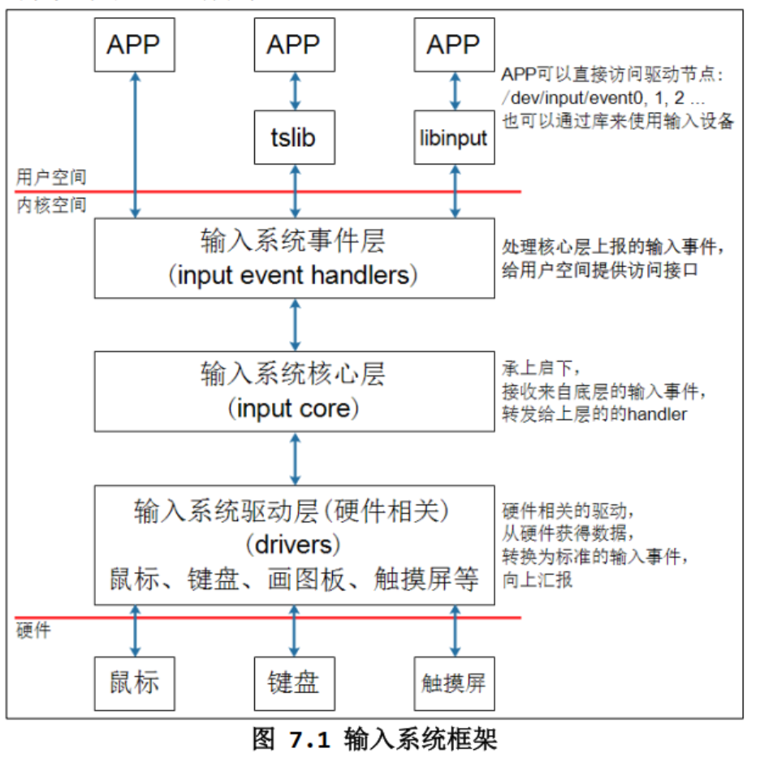

# 输出环境变量
1.将路径永久添加到环境变量中  
echo $PATH//查看有哪些文件夹在环境变量中，将文件复制进去就行  
2.修改bashrc  
gedit ~/.bashrc  
在最后一行添加  
export PATH=$PATH:/文件位置  
3.临时改变环境变量  
export PATH=$PATH:文件位置  
 
# Makefile
目标 ： 依赖项  
    命令  
当依赖项比目标新，则执行命令  
hello : a.o b.o  
    gcc a.o b.o -o hello  
a.o : a.c  
    gcc -c -o a.o a.c  
b.o : b.c  
    gcc -c -o b.o b.c  
## 通配符
所有以后缀.c .o结尾的文件  
%.c %.o  
//目标文件  
$@  
第一个依赖项  
$<  
所有依赖项  
$^  
hello : a.o b.o  
    gcc $^ -o $@  
%.o : %.c  
    gcc -o $@ $<  

## 赋值和变量
使用时赋值  
=  
定义时赋值  
:=    
a = $(c)  
b := $(c)  
c = 123  
hello:  
    @echo $(a)    
    @echo $(b)  
a = 空  
b = 123  
## 函数
### foreach 遍历A中元素
$(foreach var,list,text)
for each var in list, change it to text  
A = a b c  
B = $(foreach f,$(A),$(f).o)  
all :
    @echo B = $(B)  
```
a.o b.o c.o
```
### filter 取出符合A中格式的值
$(filter pattern,text)
C = a b c d/  
D = $(filter %/,$(C))  
hellp:  
	@echo $(D)  
```
d/
```
### wildcard在当前目录下查找符合条件的文件  
$(wildcard pattern)
files = $(wildcard *.c)  
hellp:  
	@echo $(files)   
```
a.c
```
### patsubst 替换
$(patsubst pattern,replacement,$(var))
file = a.c b.c c.c  
out = $(patsubst %.c,%.d,$(file))  
hellp:  
	@echo $(out)  
```
a.d b.d c.d
```
## 示例
gcc -M a.c 打印出a.c的所有依赖文件
gcc -M -MF c.d a.c 把依赖文件写入c.d中
gcc -c -o c.o c.c -MD -MF .c.d 编译c.o，把依赖写入文件.c.d中
### 常用参数
make[-f file] [options] [target]  
make 默认在当前目录中查找GUNmakefile、makefile 及 Makefile 文件作为make的输入文件  
-f 指定文件作为输入文件  
-v 显示版本号  
-n 只输出命令不执行， 一般作为测试  
-s 执行命令不显示命令，  
-w 显示执行前和执行后的路径  
-C dir 指定makefile 所在的目录  
# 文件IO
### 错误信息
errno：标准错误号，通过errno可以找到错误信息  #include <errno.h>  
perror：打印输入字符串后打印错误信息  #include <stdio.h> void perror(const char *s);    
strerror：输入错误号，得到错误信息 #include <string.h> char *strerror(int errnum);  
### 文件句柄
文件句柄（File Handle）是操作系统中用于访问文件的一种数据结构，通常是一个整数或指针。文件句柄用于标识打开的文件，每个打开的文件都有一个唯一的文件句柄。  
在 Linux 和 Unix 系统中，文件句柄是通过调用 open() 系统调用打开文件时返回的。当打开一个文件时，操作系统会为该文件分配一个文件句柄，并将其返回给应用程序。应用程序可以使用文件句柄来读取、写入、关闭文件等操作。  
```
include<stdio.h>
int main(){
    printf("hello world!);
}
```
在以上代码中，文件句柄：  
0 stdin  
1 stdout  
2 stderror  
### dup函数
int dup(int oldfd);复制原来的文件句柄，并返回
int dup2(int oldfd, int newfd);先关闭newfd，将newfd只想oldfd
例如将printf的文件句柄替换成打开文件的句柄
```
fd = open("1.txt",O_RDWR);
dup2(fd,1);
printf("hello world!");
```
将“hello world！”打印到文件中  
# 输入系统编程
  
## APP访问硬件的四种方式
int ioctl(int fd, unsigned long request, ...);  
可以获取设备的信息
### 查询方式  
在OPEN函数中传入O_NOBLOCK表示非阻塞，当驱动程序中有数据则返回数据，如果没有数据则返回错误。  
### 休眠-唤醒  
在OPEN函数中不传入O_NOBLOCK，当有数据时返回，没有数据时休眠   
### POLL/SELECT方式
使用poll或者select设置延时，当延时到时没有数据则休眠，当有数据时则返回  
当在休眠期间操作硬件，则唤醒APP  
poll/select可以检测多个文件  
```
struct pollfd fds[1];
int timeout_ms = 5000;
int ret;
fds[0].fd = fd;
fds[0].events = POLLIN;
ret = poll(fds, 1, timeout_ms);
if ((ret == 1) && (fds[0].revents & POLLIN))
{
read(fd, &val, 4);
printf("get button : 0x%x\n", val);
}
```
### 异步通知
当驱动程序有数据则主动通知APP  
编程步骤：
```
1.编写信号处理函数：
static void sig_func(int sig)
{
int val;
read(fd, &val, 4);
printf("get button : 0x%x\n", val);
}
2.注册信号处理函数:
signal(SIGIO, sig_func);
3.打开驱动：
fd = open(argv[1], O_RDWR);
4.把进程 ID 告诉驱动：
fcntl(fd, F_SETOWN, getpid());
5.使能驱动的 FASYNC 功能：
flags = fcntl(fd, F_GETFL);
fcntl(fd, F_SETFL, flags | FASYNC);
```
# 网络编程
## int socket(int domain, int type,int protocol);
创建一个套接字  
## int bind(int sockfd, struct sockaddr *my_addr, int addrlen);  
绑定IP  
## int listen(int sockfd,int backlog);
监听是否有请求输入  
## int accept(int sockfd, struct sockaddr *addr,int *addrlen);
接收请求  
## int connect(int sockfd, struct sockaddr * serv_addr,int addrlen);
建立连接  
## ssize_t send(int sockfd, const void *buf, size_t len, int flags);
客户端或者服务器发送数据  
## ssize_t recv(int sockfd, void *buf, size_t len, int flags);
客户端或者服务器接受数据  
## ssize_t recvfrom(int sockfd, void *buf, size_t len, int flags,struct sockaddr *src_addr, socklen_t *addrlen);
用于获得发送者的地址  
# 多线程编程
所谓线程，就是操作系统所能调度的最小单位。普通的进程，只有一个线程在执行对应的逻辑。我们可以通过多线程编程，使一个进程可以去执行多个不同的任务。相比多进程编程而言，线程享有共享资源，即在进程中出现的全局变量，每个线程都可以去访问它。  
## 创建线程  
pthread_t tid1;线程号  
int pthread_create(pthread_t *thread, const pthread_attr_t *attr,void *(*start_routine) (void *), void *arg);  
线程创建函数，返回0为创建成功  
第一个参数为 pthread_t 指针，用来保存新建线程的线程号  
第二个参数表示了线程的属性，一般传入 NULL 表示默认属性  
第三个参数是一个函数指针，就是线程执行的函数  
第四个参数则表示为向线程处理函数传入的参数  
```
#include<stdio.h>
#include <pthread.h>
#include<unistd.h>
#include<error.h>
#include<string.h>
struct myst{
    int id;
    char an[100];
    float mask;
};
void *func2(void *arc){
    struct myst *t = (struct myst *)arc;
    printf("%s ,id : %d,name = %s,mask : %f\n",__FUNCTION__,(*t).id,\
    t->an,t->mask);
}
int main(){
    pthread_t tid2;
    struct myst p ;
    p.id = 115200;
    strcpy(p.an,"hello world!");
    p.mask = 3.14;
    int ret;
    ret = pthread_create(&tid2,NULL,func2,(void *)&p);
    sleep(1);
    printf("%s: id:%d,name : %s,mask : %f\n",__FUNCTION__,p.id,p.an,p.mask);
    return 0;
}
```  
## 线程的退出与回收  
void pthread_exit(void *retval);主动退出，线程自身调用  
int pthread_cancel(pthread_t thread);被动退出，由其他地方调用  
int pthread_join(pthread_t thread, void **retval);  
线程资源回收，第一个为线程号，第二个为线程返回的数据  
int pthread_tryjoin_np(pthread_t thread, void **retval);非阻塞回收，线程根据退出先后顺序回收  
## 多线程编程临界资源访问  
多个线程争夺一个全局变量的控制权  
### 互斥锁  
用于解决多线程中争夺变量控制的问题  
当一个线程使用互斥量时，其他线程不能使用  
pthread_mutex_t mutex；初始化互斥量  
int pthread_mutex_init(phtread_mutex_t *mutex,const pthread_mutexattr_t *restrict attr);  
互斥锁初始化，第一个参数为互斥量，第二个参数为控制量属性，通常为NULL  
int pthread_mutex_lock(pthread_mutex_t *mutex);互斥量加锁，其他线程不可访问  
int pthread_mutex_unlock(pthread_mutex_t *mutex);互斥量解锁，其他线程访问  
当执行lock后必须执行unlock，否则会发生死锁现象。  
int pthread_mutex_trylock(pthread_mutex_t *mutex);非阻塞加锁  
int pthread_mutex_destory(pthread_mutex_t *mutex);摧毁锁  
```
#define _GNU_SOURCE 
#include<stdio.h>
#include <pthread.h>
#include<unistd.h>
#include<error.h>
#include<string.h>
#include <pthread.h>

pthread_mutex_t mutex;
int a = 0;

void *func1(void *arc){
    pthread_mutex_lock(&mutex);
    for(;a < 3;){
        a++;
        printf("%s ,num is %d\n",__FUNCTION__,a);
    }
    pthread_mutex_unlock(&mutex);
    pthread_exit(NULL);
}
void *func2(void *arc){
    pthread_mutex_lock(&mutex);
    for(;a > -3;){
        a--;
        printf("%s,num is %d\n",__FUNCTION__,a);
    }
    pthread_mutex_unlock(&mutex);
    pthread_exit(NULL);
}
int main(){
    int ret;
    pthread_t pid1,pid2;
    pthread_mutex_init(&mutex,NULL);
    ret = pthread_create(&pid1,NULL,func1,NULL);
    ret = pthread_create(&pid2,NULL,func2,NULL);
    pthread_join(pid1,NULL);
    pthread_join(pid2,NULL);
    pthread_mutex_destroy(&mutex);
    return 0;
}
```
## 多线程编程顺序控制  
线程的执行顺序是无序执行的，需要通过信号量API解决  
### 信号量P/V操作  
sem_t sem1；定义信号量  
int sem_init(sem_t *sem,int pshared,unsigned int value);  
初始化信号量  
第一个参数为信号量变量  
第二个参数为线程控制，0为线程控制，其他为进程控制  
第三个参数为信号量初始化值，1为可运行，0为阻塞  
int sem_wait(sem_t *sem);  
传如的信号量为1时运行，启动后sem - 1  
int sem_post(sem_t *sem);  
启动后使sem + 1  
int sem_destory(sem_t *sem);  
信号量销毁  
```
#define _GNU_SOURCE 
#include<stdio.h>
#include <pthread.h>
#include<unistd.h>
#include<error.h>
#include<string.h>
#include <pthread.h>
#include <semaphore.h>

sem_t sim1,sim2,sim3;

void *func1(void * arc){
    sem_wait(&sim1);
    printf("%s called\n",__FUNCTION__);
    sem_post(&sim2);
    pthread_exit(NULL); 
}

void *func2(void * arc){
    sem_wait(&sim2);
    printf("%s called\n",__FUNCTION__);
    sem_post(&sim3);
    pthread_exit(NULL); 
}

void *func3(void * arc){
    sem_wait(&sim3);
    printf("%s called\n",__FUNCTION__);
    sem_post(&sim1);
    pthread_exit(NULL); 
}

int main(){

    pthread_t pid1,pid2,pid3;
    int ret;
    sem_init(&sim1,0,1);
    sem_init(&sim2,0,0);
    sem_init(&sim3,0,0);
    ret = pthread_create(&pid1,NULL,func1,NULL);
    ret = pthread_create(&pid2,NULL,func2,NULL);
    ret = pthread_create(&pid3,NULL,func3,NULL);

    pthread_join(pid1,NULL);
    pthread_join(pid2,NULL);
    pthread_join(pid3,NULL);

    sem_destroy(&sim1);
    sem_destroy(&sim2);
    sem_destroy(&sim3);

    return 0;
}
```
# 普通驱动编程顺序  
用户层和内核层的独立编程，可以使内核层的代码通用化，只需修改用户层即可改变驱动程序  
## 1.用户层编程顺序  
以LED为例  
1.查找原理图，找到需要点亮的LED所在的GPIO位置，例GPIO5_3  
2.找到手册中时钟使能模块对应的GPIO，例CCGR1[CG15](GPIO5_CLK_ENABLE)  
说明CCGR1的CG15位控制GPIO5的时钟使能 0x020C406C   
3.找到GPIO定义，配置IOMUX，例SNVS_TAMPER3为GPIO5_3的控制信号，模式为ALT5 0x02290014  
4.配置GPIO5_GDIR方向寄存器，0x020AC004
5.配置GPIO5_GD数据寄存器对应的位GPIO5_3对应该寄存器的第3位设0，0x020AC000  
### 1.定义结构体及返回函数
```
#ifndef _LED_H
#define _LED_H

struct led_operations {
    int num;//设备个数
    int (*init) (int which);//初始化设备，which为副设备号
    int (*ctl) (int which,char status);//控制设备状态
    void (*exit)(void);
};

struct led_operations * get_led_opr(void);//函数，用于返回定义的led_operations结构体

#endif // !_LED_H#define _LED_H
```
### 2.实例化结构体及返回函数
```
static struct led_operations stu_led = {
    .num = 1,
    .init = led_init,
    .ctl = led_ctl,
    .exit = led_exit
} ;

struct led_operations * get_led_opr(void){
    return &stu_led;
}
```
### 3.实现结构体中定义的函数
```
//定义指针用于保存映射后的地址
static volatile int *clk_reg;
static volatile int *mux_reg ;
static volatile int *dr ;
static volatile int *data ;

int led_init (int which){
    printk("%s %s",__FILE__,__FUNCTION__);
    //将物理地址映射成虚拟地址
    clk_reg = ioremap(0x020C406C,4);
    mux_reg = ioremap(0x02290014,4);
    dr = ioremap(0x020AC004,4);
    data = ioremap(0x020AC000,4);
    //配置时钟使能寄存器
    *clk_reg &= ~(3 << 30);
    *clk_reg |= (3 << 30);
    //配置iomux寄存器
    *mux_reg &= ~(0xf);
    *mux_reg |= (0x5);
    //配置方向寄存器
    *dr |= (1 << 3); 
    return 0;
}

int led_ctl (int which,char status){
    printk("%s %s",__FILE__,__FUNCTION__);
    if(status){
        //配置数据寄存器
        *data &= ~(1 << 3);
    }
    else{
        *data |= (1 << 3);
    }
    return 0;
}

void led_exit(void){
    //解除地址映射
    iounmap(clk_reg);
    iounmap(mux_reg);
    iounmap(dr);
    iounmap(data);
}
```
## 2.设备底层编程顺序
### 1.确定主设备号
```
static int major;//主设备号
static struct class *led_class;//设备节点
static struct led_operations *led_ptr;//分层中用户操作部分
```
### 2.定义自己的file_operations结构体
```
static struct file_operations led_drv = {
    .owner = THIS_MODULE,
    .open = led_open,
    .write = led_write
};
```
### 3.实现结构体中定义的函数
```
static int led_open (struct inode *node, struct file *file){
    int num;
    num = iminor(node);//从节点找到需要初始化的设备
    led_ptr->init(num);
    return 0;
}

static ssize_t led_write (struct file *file, const char __user *buf, size_t size, loff_t *offset){
    int num;
    int err;
    char status;
    struct inode *node;
    node = file_inode(file);
    num = iminor(node);
    err = copy_from_user(&status,buf,1);//将测试程序中输入的数据传递给内核
    led_ptr->ctl(num,status);//根据数据设置驱动状态
    return 0;
    
}
```
### 4.定义注册入口函数
```
static int led_init(void){
    int i;
    int err;
    major = register_chrdev(0,"myled",&led_drv);//注册
    led_class = class_create(THIS_MODULE,"ledclass");//创建节点
    led_ptr = get_led_opr();//获得用户定义的结构体
    for(i = 0;i < led_ptr->num;i++){
        device_create(led_class,NULL,MKDEV(major,i),NULL,"ledclass%d",i);//创建设备
    }
    return 0;
}
```
### 5.定义出口函数
```
static void led_exit(void){
    int i;
    int err;
    led_ptr->exit();//释放映射的空间
    for(i = 0;i < led_ptr->num;i++){
        device_destroy(led_class,MKDEV(major,i));
    }
    class_destroy(led_class);
    unregister_chrdev(major,"myled");
    
}
```
### 6.提供设备信息，自动创建设备节点
```
module_init(led_init);
module_exit(led_exit);
MODULE_LICENSE("GPL");
```

# 驱动总线编程方法  
利用分离的思想  
将程序分为设备和驱动两部分  
## 设备端代码
```
led_device.c

#include <linux/module.h>

#include <linux/fs.h>
#include <linux/errno.h>
#include <linux/miscdevice.h>
#include <linux/kernel.h>
#include <linux/major.h>
#include <linux/mutex.h>
#include <linux/proc_fs.h>
#include <linux/seq_file.h>
#include <linux/stat.h>
#include <linux/init.h>
#include <linux/device.h>
#include <linux/tty.h>
#include <linux/kmod.h>
#include <linux/gfp.h>
#include <linux/platform_device.h>
#include "led_resource.h"

static void led_dev_release(struct device *dev)
{
}
//定义资源列表
static struct resource resources[] = {
        {
                .start = GROUP_PIN(3,1),
                .flags = IORESOURCE_IRQ,
                .name = "100ask_led_pin",
        },
		{
				.start = GROUP_PIN(5,8),
				.flags = IORESOURCE_IRQ,
				.name = "100ask_led_pin",
		},
};

//定义平台设备结构体
static struct platform_device led_device = {
		.name = "100ask_led",
		.num_resources = ARRAY_SIZE(resources),
		.resource = resources,
		.dev = {
				.release = led_dev_release,
		 },
};
//设备初始化
static int __init led_dev_init(void)
{
	int err;
	
	err = platform_device_register(&led_device);	
	
	return 0;
}
//设备退出
static void __exit led_dev_exit(void)
{
	platform_device_unregister(&led_device);
}

module_init(led_dev_init);
module_exit(led_dev_exit);

MODULE_LICENSE("GPL");
```
## 驱动端代码
```
led_driver.c

#include <linux/module.h>

#include <linux/fs.h>
#include <linux/errno.h>
#include <linux/miscdevice.h>
#include <linux/kernel.h>
#include <linux/major.h>
#include <linux/mutex.h>
#include <linux/proc_fs.h>
#include <linux/seq_file.h>
#include <linux/stat.h>
#include <linux/init.h>
#include <linux/device.h>
#include <linux/tty.h>
#include <linux/kmod.h>
#include <linux/gfp.h>
#include <linux/platform_device.h>

#include "led_opr.h"
#include "leddrv.h"
#include "led_resource.h"

static int g_ledpins[100];
static int g_ledcnt = 0;

//led初始化，用于查找GPIO5的各个寄存器初始化
static int board_demo_led_init (int which) /* 初始化LED, which-哪个LED */       
{   
    //printk("%s %s line %d, led %d\n", __FILE__, __FUNCTION__, __LINE__, which);
    
    printk("init gpio: group %d, pin %d\n", GROUP(g_ledpins[which]), PIN(g_ledpins[which]));
    switch(GROUP(g_ledpins[which]))
    {
        case 0:
        {
            printk("init pin of group 0 ...\n");
            break;
        }
        case 1:
        {
            printk("init pin of group 1 ...\n");
            break;
        }
        case 2:
        {
            printk("init pin of group 2 ...\n");
            break;
        }
        case 3:
        {
            printk("init pin of group 3 ...\n");
            break;
        }
    }
    
    return 0;
}

//对单个GPIO5_3进行配置，控制亮灭
static int board_demo_led_ctl (int which, char status) /* 控制LED, which-哪个LED, status:1-亮,0-灭 */
{
    //printk("%s %s line %d, led %d, %s\n", __FILE__, __FUNCTION__, __LINE__, which, status ? "on" : "off");
    printk("set led %s: group %d, pin %d\n", status ? "on" : "off", GROUP(g_ledpins[which]), PIN(g_ledpins[which]));

    switch(GROUP(g_ledpins[which]))
    {
        case 0:
        {
            printk("set pin of group 0 ...\n");
            break;
        }
        case 1:
        {
            printk("set pin of group 1 ...\n");
            break;
        }
        case 2:
        {
            printk("set pin of group 2 ...\n");
            break;
        }
        case 3:
        {
            printk("set pin of group 3 ...\n");
            break;
        }
    }

    return 0;
}
//led控制结构体
static struct led_operations board_demo_led_opr = {
    .init = board_demo_led_init,
    .ctl  = board_demo_led_ctl,
};
//返回led控制结构体
struct led_operations *get_board_led_opr(void)
{
    return &board_demo_led_opr;
}
//驱动查找设备
static int chip_demo_gpio_probe(struct platform_device *pdev)
{
    struct resource *res;
    int i = 0;

    while (1)
    {
        res = platform_get_resource(pdev, IORESOURCE_IRQ, i++);
        if (!res)
            break;
        
        g_ledpins[g_ledcnt] = res->start;
        led_class_create_device(g_ledcnt);
        g_ledcnt++;
    }
    return 0;
    
}
//移除设备
static int chip_demo_gpio_remove(struct platform_device *pdev)
{
    struct resource *res;
    int i = 0;

    while (1)
    {
        res = platform_get_resource(pdev, IORESOURCE_IRQ, i);
        if (!res)
            break;
        
        led_class_destroy_device(i);
        i++;
        g_ledcnt--;
    }
    return 0;
}

//驱动结构体
static struct platform_driver led_driver = {
    .probe      = chip_demo_gpio_probe,
    .remove     = chip_demo_gpio_remove,
    .driver     = {
        .name   = "100ask_led",
    },
};
//驱动初始化
static int __init chip_demo_gpio_drv_init(void)
{
    int err;
    
    err = platform_driver_register(&led_driver); 
    register_led_operations(&board_demo_led_opr);
    
    return 0;
}
//驱动卸载
static void __exit lchip_demo_gpio_drv_exit(void)
{
    platform_driver_unregister(&led_driver);
}

module_init(chip_demo_gpio_drv_init);
module_exit(lchip_demo_gpio_drv_exit);

MODULE_LICENSE("GPL");

```

## 通用模块 leddrv.v
用于对led底层进行控制
```
#include <linux/module.h>

#include <linux/fs.h>
#include <linux/errno.h>
#include <linux/miscdevice.h>
#include <linux/kernel.h>
#include <linux/major.h>
#include <linux/mutex.h>
#include <linux/proc_fs.h>
#include <linux/seq_file.h>
#include <linux/stat.h>
#include <linux/init.h>
#include <linux/device.h>
#include <linux/tty.h>
#include <linux/kmod.h>
#include <linux/gfp.h>

#include "led_opr.h"


/* 1. 确定主设备号                                                                 */
static int major = 0;
static struct class *led_class;
struct led_operations *p_led_opr;


#define MIN(a, b) (a < b ? a : b)

//这里把获得led控制结构体和创建/移除设备函数单独封装
void led_class_create_device(int minor)
{
	device_create(led_class, NULL, MKDEV(major, minor), NULL, "100ask_led%d", minor); /* /dev/100ask_led0,1,... */
}
void led_class_destroy_device(int minor)
{
	device_destroy(led_class, MKDEV(major, minor));
}
void register_led_operations(struct led_operations *opr)
{
	p_led_opr = opr;
}

EXPORT_SYMBOL(led_class_create_device);
EXPORT_SYMBOL(led_class_destroy_device);
EXPORT_SYMBOL(register_led_operations);


/* 3. 实现对应的open/read/write等函数，填入file_operations结构体                   */
static ssize_t led_drv_read (struct file *file, char __user *buf, size_t size, loff_t *offset)
{
	printk("%s %s line %d\n", __FILE__, __FUNCTION__, __LINE__);
	return 0;
}

/* write(fd, &val, 1); */
static ssize_t led_drv_write (struct file *file, const char __user *buf, size_t size, loff_t *offset)
{
	int err;
	char status;
	struct inode *inode = file_inode(file);
	int minor = iminor(inode);
	
	printk("%s %s line %d\n", __FILE__, __FUNCTION__, __LINE__);
	err = copy_from_user(&status, buf, 1);

	/* 根据次设备号和status控制LED */
	p_led_opr->ctl(minor, status);
	
	return 1;
}

static int led_drv_open (struct inode *node, struct file *file)
{
	int minor = iminor(node);
	
	printk("%s %s line %d\n", __FILE__, __FUNCTION__, __LINE__);
	/* 根据次设备号初始化LED */
	p_led_opr->init(minor);
	
	return 0;
}

static int led_drv_close (struct inode *node, struct file *file)
{
	printk("%s %s line %d\n", __FILE__, __FUNCTION__, __LINE__);
	return 0;
}

/* 2. 定义自己的file_operations结构体                                              */
static struct file_operations led_drv = {
	.owner	 = THIS_MODULE,
	.open    = led_drv_open,
	.read    = led_drv_read,
	.write   = led_drv_write,
	.release = led_drv_close,
};

/* 4. 把file_operations结构体告诉内核：注册驱动程序                                */
/* 5. 谁来注册驱动程序啊？得有一个入口函数：安装驱动程序时，就会去调用这个入口函数 */
static int __init led_init(void)
{
	int err;
	
	printk("%s %s line %d\n", __FILE__, __FUNCTION__, __LINE__);
	major = register_chrdev(0, "100ask_led", &led_drv);  /* /dev/led */


	led_class = class_create(THIS_MODULE, "100ask_led_class");
	err = PTR_ERR(led_class);
	if (IS_ERR(led_class)) {
		printk("%s %s line %d\n", __FILE__, __FUNCTION__, __LINE__);
		unregister_chrdev(major, "led");
		return -1;
	}
	
	return 0;
}

/* 6. 有入口函数就应该有出口函数：卸载驱动程序时，就会去调用这个出口函数           */
static void __exit led_exit(void)
{
	printk("%s %s line %d\n", __FILE__, __FUNCTION__, __LINE__);

	class_destroy(led_class);
	unregister_chrdev(major, "100ask_led");
}


/* 7. 其他完善：提供设备信息，自动创建设备节点                                     */

module_init(led_init);
module_exit(led_exit);

MODULE_LICENSE("GPL");

```
## 其他.h文件
```
#ifndef _LED_OPR_H
#define _LED_OPR_H

struct led_operations {
	int (*init) (int which); /* 初始化LED, which-哪个LED */       
	int (*ctl) (int which, char status); /* 控制LED, which-哪个LED, status:1-亮,0-灭 */
};

struct led_operations *get_board_led_opr(void);


#endif

#ifndef _LED_RESOURCE_H
#define _LED_RESOURCE_H

/* GPIO3_0 */
/* bit[31:16] = group */
/* bit[15:0]  = which pin */
#define GROUP(x) (x>>16)
#define PIN(x)   (x&0xFFFF)
#define GROUP_PIN(g,p) ((g<<16) | (p))


#endif

#ifndef _LEDDRV_H
#define _LEDDRV_H

#include "led_opr.h"

void led_class_create_device(int minor);
void led_class_destroy_device(int minor);
void register_led_operations(struct led_operations *opr);

#endif /* _LEDDRV_H */
```
# 设备树DTS  
与总线差不多，区别在于需要将设备写入设备树中  
通过compatible将驱动与设备联系起来  


